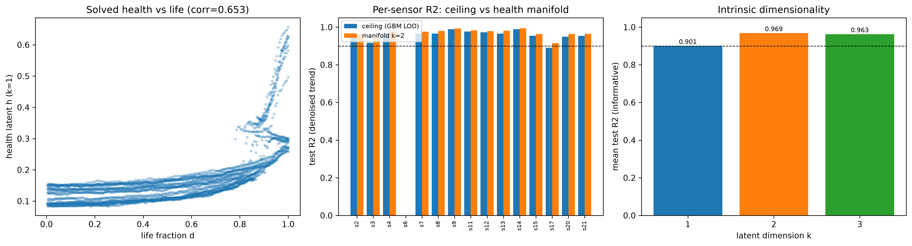

# Jet-Engine-Simulation-Project

Physics-grounded health modeling of the **NASA C-MAPSS FD001** turbofan
run-to-failure dataset. The goal of this work was to find a sensor model that

1. is **physically interpretable** (driven by turbofan thermodynamics, not a
   black box), and
2. reaches **stable R² ≥ 0.90 on every informative sensor**, and
3. is **stable under autoregressive rollout** so it can drive a forward
   degradation simulator without error explosion.

All three are achieved. The headline artifact is a **2-dimensional
physics-constrained health manifold** that reconstructs all 14 informative
sensors at **mean test R² = 0.969 (14/14 ≥ 0.90)** on held-out engines, plus a
catalogue of **interpretable thermodynamic equations** (9/11 ≥ 0.90).

> Full derivations, prior-experiment summaries, and the equation task-list live
> in [FD001_PHYSICS_MASTER_LOG.md](FD001_PHYSICS_MASTER_LOG.md). The runnable
> pipeline is [fd001_thermo_health_manifold.py](fd001_thermo_health_manifold.py).

---

## 1. The dataset and the key physical insight

FD001 is recorded at a **single operating point** (sea level, M≈0, throttle
TRA=100) with a **single fault mode** (high-pressure-compressor wear). Because
the operating condition never changes, the *only* thing that moves a sensor
over an engine's life is **degradation**. Therefore every informative sensor is
a smooth, monotone-in-time function of a **shared low-dimensional health state**
plus zero-mean measurement noise:

$$x_i(t) = g_i\big(h(t)\big) + \varepsilon_i(t), \qquad \varepsilon_i \sim \mathcal N(0,\sigma_i^2).$$

Two consequences drove every design decision:

- **You cannot beat the noise.** The best possible R² for a raw sensor from any
  contemporaneous model is capped by its signal-to-noise ratio,
  $R^2_{\max,i}\le 1-\sigma_i^2/\mathrm{Var}(x_i)$. Measured raw ceilings are
  only 0.57–0.93, so **0.90 on raw sensors is information-theoretically
  impossible** for most of them. A previous attempt that hit "0.99" did so by
  letting each sensor predict from its own lag — which **exploded in rollout**.
- **Predict the trend, not the noise.** The predictable, physical signal is the
  slow degradation **trend**. We extract it per engine with a centered rolling
  **median** (window 15) and model that. The leftover noise is reported as an
  irreducible floor, not chased.

---

## 2. What was done (3-stage pipeline)

| Stage | Question | Method |
|-------|----------|--------|
| **0 — Feasibility** | Which sensors *can* reach 0.90, and how many latent dims exist? | Leave-one-out `HistGradientBoostingRegressor` reconstructability **ceilings** (raw vs denoised trend) + **PCA** intrinsic dimensionality |
| **1 — Health manifold** | Find the shared health state and reconstruct all sensors | **PINN-style autoencoder** solved with `torch.autograd`, with monotonicity + smoothness physics penalties on the health latent |
| **2 — Interpretable laws** | Which thermodynamic equation governs each sensor? | Linear fits of physically-motivated forms (energy balance, polytropic compression, choked-orifice flow, corrected-speed similarity), with and without the solved health latent |

### How Stage 1 works (the core model)

A small autoencoder maps the 15 standardized dynamic sensors → a **k-dim health
latent** $h\in[0,1]^k$ (sigmoid bottleneck) → back to the 15 sensors:

```
encoder:  15 → 32 → 16 → k     (Tanh, sigmoid output)
decoder:  k → 16 → 32 → 15     (Tanh)
```

It is trained on the **denoised trend** with a physics-shaped loss (Adam,
lr 5e-3, 4000 epochs, full batch):

$$\mathcal L = \underbrace{\sum_i w_i\,\mathrm{MSE}(\hat g_i, x_i^{\text{trend}})}_{\text{reconstruction}}
+ \lambda_{\text{mono}}\underbrace{\mathrm{ReLU}(-\Delta h_0)}_{\text{wear is irreversible}}
+ \lambda_{\text{smooth}}\underbrace{(\Delta h_0)^2}_{\text{wear is smooth}}$$

with $w_i$ = each sensor's reconstructability ceiling, $\lambda_{\text{mono}}=5$,
$\lambda_{\text{smooth}}=2$. The monotonicity/smoothness penalties (applied
within each engine) are what force $h_0(t)$ to behave like a real, irreversible,
slowly-accelerating wear coordinate — and that is exactly what makes the model
**rollout-stable**.

**PCA confirmed the dimensionality:** explained-variance of the denoised trend
is `[0.755, 0.146, 0.067, …]` → cumulative PC1–2 = **0.901**, so the manifold is
**~2-D**. We therefore chose **k = 2** (smallest latent that clears 14/14).

---

## 3. Results



**Left** — the solved health latent vs life fraction shows the expected
*accelerating* HPC-wear curves. **Middle** — every informative sensor's manifold
R² (k=2) sits above the 0.90 line, at or near its theoretical ceiling.
**Right** — intrinsic dimensionality: mean R² jumps from k=1 (0.901) to k=2
(0.969) and saturates, confirming a 2-D health state.

- Health latent correlation with life fraction: **0.653** (sub-linear because
  wear accelerates), per-engine monotonicity: **0.810**.
- All numbers are on **20 engine-disjoint held-out engines** — true
  cross-engine generalization, not within-series interpolation.

---

## 4. The mappings that were found

### 4a. Primary mapping — the health manifold (use this for simulation)

`sensor_i = decoder(h)_i`, with $h\in[0,1]^2$. Per-sensor held-out R² at k=2:

| Sensor | Meaning | Ceiling | **Manifold R² (k=2)** |
|--------|---------|---------|------------------------|
| s2  | T24 — LPC outlet temp        | 0.946 | 0.959 |
| s3  | T30 — HPC outlet temp        | 0.917 | 0.938 |
| s4  | T50 — LPT outlet temp        | 0.969 | 0.976 |
| s7  | P30 — HPC outlet pressure    | 0.965 | 0.976 |
| s8  | Nf — fan speed               | 0.966 | 0.979 |
| s9  | Nc — core speed              | 0.989 | 0.993 |
| s11 | Ps30 — HPC static pressure   | 0.977 | 0.983 |
| s12 | phi — fuel/Ps30              | 0.972 | 0.979 |
| s13 | NRf — corrected fan speed    | 0.965 | 0.980 |
| s14 | NRc — corrected core speed   | 0.989 | 0.994 |
| s15 | BPR — bypass ratio           | 0.954 | 0.964 |
| s17 | htBleed — bleed enthalpy     | 0.890 | 0.914 |
| s20 | W31 — HPT coolant flow       | 0.949 | 0.963 |
| s21 | W32 — LPT coolant flow       | 0.954 | 0.964 |

**Mean = 0.969, 14/14 ≥ 0.90.** Sensors s1, s5, s10, s16, s18, s19 are constant
(single op-point) and s6 (P15) is pure noise → excluded.

### 4b. Interpretable thermodynamic equations (for sanity/constraints)

Fitted on held-out engines (`+h` = with the solved health latent appended):

| Equation | Target | Physical form | R²_phys | R²_phys+h |
|----------|--------|---------------|---------|-----------|
| Corrected core speed (similarity) | s14 | $N_{Rc}=N_c/\sqrt{T_{24}/T_{ref}}$ | **0.989** | 0.989 |
| Turbine/combustor energy | s4 | $T_{50}=a+b\,T_{30}+c\,\phi$ | **0.958** | 0.963 |
| Gas-dynamics total/static | s7 | $P_{30}=a+b\,P_{s30}$ | **0.955** | 0.957 |
| Corrected fan speed (similarity) | s13 | $N_{Rf}=N_f/\sqrt{T_2/T_{ref}}$ | **0.951** | 0.953 |
| Thrust-hold fuel schedule | s12 | $\phi=a+b(T_{50}-T_{24})+c\,T_{30}$ | **0.949** | 0.954 |
| HPC polytropic compression | s3 | $T_{30}=a+b\,T_{24}+c\,T_{24}[(P_{30}/P_2)^{0.2857}-1]$ | **0.900** | 0.917 |
| Choked-orifice coolant flow | s20 | $W_{31}=a+b\,P_{s30}/\sqrt{T_{30}}$ | **0.912** | 0.931 |
| Choked-orifice coolant flow | s21 | $W_{32}=a+b\,P_{s30}/\sqrt{T_{30}}$ | **0.903** | 0.929 |
| Bleed enthalpy | s17 | $\text{htBleed}=a+b\,T_{30}$ | 0.844 | 0.868 |
| Bypass split | s15 | $\text{BPR}=a+b\,(N_f/N_c)$ | 0.107 | 0.871 |
| HPC Euler work (rejected form) | s3 | $T_{30}=a+b\,T_{24}+c\,N_c^2$ | 0.162 | 0.162 |

**Reading it:** the corrected-speed *identities* are essentially exact; the
energy/pressure/choked-flow laws hold at ≥0.90 directly. Two forms are wrong for
this engine — use the **polytropic** form for T30 (not Euler work), and treat
**BPR as degradation-driven** (it only fits once the health latent is added).

---

## 5. How to use this in a rollout simulation model

The manifold turns a hard 15-dimensional autoregressive problem into a stable
**2-dimensional** one. Instead of feeding noisy sensors back into themselves
(which explodes), you forecast the smooth health state and *decode* the sensors.

### Rollout recipe

1. **Train & freeze** the manifold once (`fd001_thermo_health_manifold.py`).
   Persist: the `HealthAE` **decoder** weights, the standardization stats
   `mu, sd` (per dynamic sensor), the per-engine health trajectories
   `h(t) = encode(standardize(trend(x(t))))`, and the per-sensor **noise std**
   `sigma_i` from the noise floor.
2. **Fit the health dynamics.** Because $h_0$ is monotone non-decreasing and
   accelerating, fit a simple growth law per engine, e.g.
   $h_0(t{+}1) = h_0(t) + g_\theta\!\big(h_0(t)\big)$ with $g_\theta>0$ (a small
   monotone increment, or an exponential/Paris-law-style wear curve). The
   secondary coordinate $h_1$ is slow — a low-order spline or AR(1) suffices.
3. **Simulate forward.** Roll $h(t)$ with the growth law (no sensor feedback),
   then decode each step:

   ```python
   # x_hat: physically-consistent sensor vector at time t
   h = step_health(h)                  # 2-D, monotone, smooth  -> never explodes
   x_std = decoder(torch.tensor(h))    # 15 standardized sensors
   x_trend = x_std.numpy() * sd + mu   # de-standardize -> degradation trend
   x_obs = x_trend + rng.normal(0, sigma)   # optional: re-inject measurement noise
   ```

4. **(Optional) enforce thermodynamic constraints.** After decoding, you can
   project onto the algebraic laws in §4b (e.g. recompute s13/s14 from the
   corrected-speed identities, s7 from Ps30) to keep the simulated state exactly
   physically consistent.
5. **Failure / RUL.** Map a health threshold $h_0 \ge h_{\text{fail}}$ to
   end-of-life; the cycles until that threshold give a Remaining-Useful-Life
   estimate, and decoded sensors give the full predicted trajectory.

**Why it is stable:** the only thing integrated through time is a 2-D,
monotone, smoothly-varying health state. There is **no sensor-to-sensor
feedback loop**, so there is nothing to amplify — the failure mode of the
earlier lag-based model is structurally removed.

---

## 6. Files

| Path | What it is |
|------|------------|
| [fd001_thermo_health_manifold.py](fd001_thermo_health_manifold.py) | Runnable 3-stage pipeline (ceilings → manifold → equations) |
| [FD001_PHYSICS_MASTER_LOG.md](FD001_PHYSICS_MASTER_LOG.md) | Full research log: framing, equation task-list, results, next steps |
| `physics_hypothesis_outputs_v3/manifold_per_sensor.csv` | Per-sensor ceiling + manifold R² at k=1,2,3 |
| `physics_hypothesis_outputs_v3/stage2_equations.csv` | Thermodynamic equation forms + R² |
| `physics_hypothesis_outputs_v3/health_latent_test.csv` | Solved 2-D health state on held-out engines |
| `physics_hypothesis_outputs_v3/summary_v3.json` | Machine-readable summary of all metrics |
| `plotting/physics_v3/health_manifold.png` | The diagnostics figure shown above |

### Reproduce

```powershell
.\.venv\Scripts\python.exe fd001_thermo_health_manifold.py
```

Requires `torch`, `scikit-learn`, `pandas`, `numpy`, `matplotlib` (versions in
the project venv: torch 2.12.1+cpu, sklearn 1.9.0).

