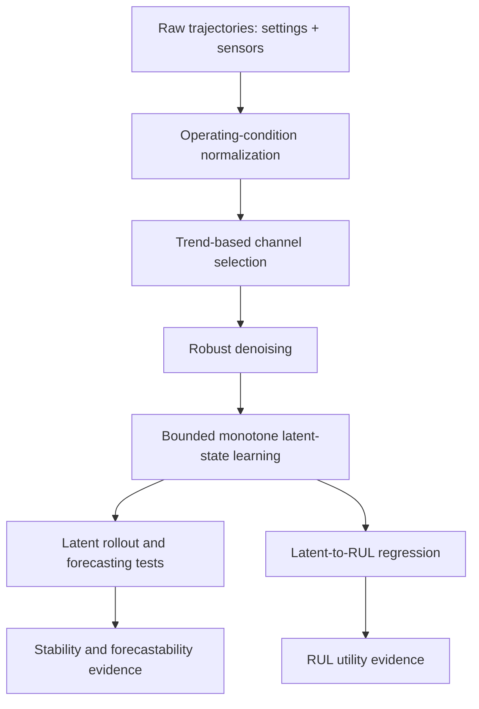
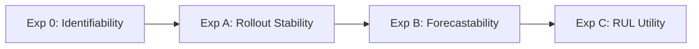
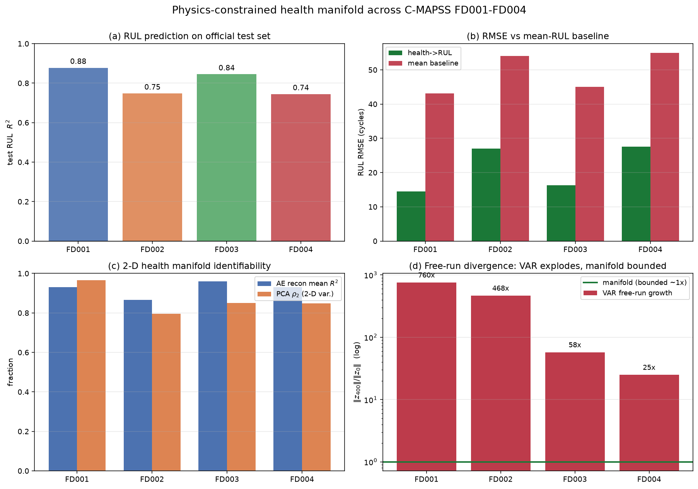

# A Bounded, Monotone Latent-Dynamics Algorithm for RUL Prediction

> One-line summary: we learn a 2D latent state from condition-normalized sensor streams, enforce bounded and monotone latent dynamics, prove stability and forecastability properties of the learned dynamics, show NASA C-MAPSS is a suitable dataset for this algorithm, and report cross-dataset results on FD001-FD004.

---

## Abstract

This document presents an algorithmic contribution for Remaining Useful Life (RUL) prediction from multivariate run-to-failure data. The method learns a low-dimensional latent state from condition-normalized sensors, imposes mathematical structure (boundedness and monotonicity), then uses that latent state for rollout, forecasting, and RUL mapping.

Important claim boundary: the latent variables are learned proxies for health, not physically measured health variables. We do not claim discovery of physically meaningful health coordinates. We claim discovery of useful hidden latent dynamics that are mathematically structured, explainable, and predictive for RUL.

---

## 1. Algorithmic Contribution and Claim Boundaries

### 1.1 Contribution

The contribution is an algorithm with three components:

1. Operating-condition normalization that removes regime staircase effects.
2. A bounded, monotone latent-state learner (2D autoencoder with structured penalties).
3. A latent-dynamics stack for rollout, forecasting, and RUL prediction.

### 1.2 Explicit non-claims

We explicitly do not claim:

1. first-principles physical model identification,
2. discovery of true physical degradation state variables,
3. thermodynamic or component-level causal recovery.

We do claim:

1. mathematically structured latent dynamics,
2. provable stability properties of rollout,
3. empirical utility for RUL prediction across FD001-FD004.

---

## 2. Problem Setup, Conditions, and Notation

We observe engine trajectories with cycle index $t$, sensor vector $x_t \in \mathbb{R}^m$, operating settings, and run-to-failure labels in training.

Conditions assumed by the algorithm:

1. Sensor streams contain an operating-condition component and a degradation component.
2. After condition normalization, degradation is lower-dimensional than full sensor space.
3. A bounded and smooth latent representation is sufficient for practical forecasting and RUL mapping.

Notation:

| Symbol | Meaning |
|---|---|
| $x_t$ | raw sensor vector at cycle $t$ |
| $c_t$ | regime label at cycle $t$ |
| $z_t$ | condition-normalized sensor residual |
| $\bar z_t$ | denoised residual |
| $h_t=(h_{0,t}, h_{1,t})$ | learned 2D latent state |
| $\rho(A)$ | spectral radius of sensor-space linear rollout |
| $\kappa$ | latent curvature bound proxy |

---

## 3. Core Algorithm (all theorem/proof math included here)

### 3.0 What The Algorithm Does

At a high level, the algorithm transforms raw multivariate time series into a
small learned latent state that is easier to forecast and safer to roll out:

1. Remove operating-condition shifts so sensors are compared on a common basis.
2. Keep channels that actually move with degradation.
3. Learn a 2D latent proxy state constrained to be bounded and monotone.
4. Forecast that latent state and map latent level/rate to RUL.

This design directly targets long-horizon stability and interpretability of
latent dynamics, rather than maximizing unconstrained one-step sensor fit.

### 3.1 Step A: Operating-condition normalization

Estimate regime labels from operating settings (rounded-setting distinct-count heuristic capped at 6, then KMeans on settings), and normalize each sensor by regime:

$$
z_{t,j} = \frac{x_{t,j} - \mu_{j,c_t}}{s_j},
$$

where $\mu_{j,c_t}$ is per-regime mean and $s_j$ is pooled within-regime standard deviation.

Purpose: isolate degradation residual from operating-point staircase effects.

### 3.2 Step B: Trend-based sensor selection and denoising

For each sensor $j$, compute trend score

$$
\tau_j = \mathbb{E}_{\text{engine}}\left[\left|\mathrm{corr}(\bar z_j, \text{cycle})\right|\right].
$$

Keep:

1. dynamic sensors: $\tau_j \ge 0.20$,
2. informative sensors: $\tau_j \ge 0.50$,

with fallback if too few channels pass.

Denoise selected channels with rolling median (window 15), trailing form for causal evaluation.

### 3.3 Step C: Bounded monotone latent-state learner

Encoder-decoder:

$$
h_t = E_\theta(\bar z_t) = \sigma(f_\theta(\bar z_t)) \in (0,1)^2,
\qquad
\hat z_t = D_\phi(h_t).
$$

Loss:

$$
\mathcal{L}
=
\underbrace{\sum_j w_j\|\hat z_{t,j}-z_{t,j}\|^2}_{\text{reconstruction}}
+
\lambda_{\text{mono}}\sum_t \mathrm{ReLU}(-\Delta h_{0,t})
+
\lambda_{\text{smooth}}\sum_t (\Delta h_{0,t})^2.
$$

Constants: $\lambda_{\text{mono}}=5.0$, $\lambda_{\text{smooth}}=2.0$, $k=2$.

Interpretation:

1. $h_0$ is a learned monotone degradation proxy.
2. $h_1$ is a learned auxiliary mode.
3. Neither is claimed to be a physical health measurement.

### 3.4 Formal result 1: effective low-dimensional sufficiency

**Lemma 1.** If $\bar z_t = g(u_t)+\eta_t$ with $\mathrm{rank}(\mathrm{Cov}(g(u_t)))\le d$ and $\mathrm{Cov}(\eta_t)\preceq \varepsilon^2 I$, then

$$
\rho_d := \frac{\sum_{i=1}^{d}\lambda_i}{\sum_{i=1}^{m}\lambda_i}
\ge
1 - \frac{(m-d)\varepsilon^2}{\sum_{i=1}^{m}\lambda_i}.
$$

**Proof.** Signal covariance contributes at most rank $d$. Trailing eigenvalues are bounded by noise via Weyl inequalities. Summing trailing mass gives $\sum_{i=d+1}^{m}\lambda_i \le (m-d)\varepsilon^2$. Rearrangement yields the bound. $\square$

Implication: high empirical $\rho_2$ supports using $k=2$ as sufficient latent dimension.

### 3.5 Formal result 2: sensor-space linear rollout can diverge

Consider free-running linear rollout in residual space:

$$
\hat z_{t+1} = A\hat z_t + b.
$$

**Theorem 1.** If error follows $e_{t+1}=Ae_t+r_t$, then

$$
e_t = A^t e_0 + \sum_{s=0}^{t-1} A^s r_{t-1-s}.
$$

If $\rho(A)>1$, geometric growth in $\|A^t\|$ yields unbounded long-horizon error unless perturbations are exactly canceled.

**Proof.** Use unrolled recursion above and Gelfand formula $\lim_{t\to\infty}\|A^t\|^{1/t}=\rho(A)$. For $\rho(A)>1$, homogeneous term grows geometrically and dominates bounded perturbation sum asymptotically. $\square$

Implication: unconstrained sensor-space autoregression is structurally unstable at long horizons when $\rho>1$.

### 3.6 Formal result 3: bounded latent rollout

Latent rollout from cutoff $c$ with local velocity $\nu$:

$$
h_t = \mathrm{clip}_{[0,1]^2}\big(h_c + (t-c)\nu\big),
\qquad
\hat z_t = D_\phi(h_t).
$$

**Theorem 2.** If decoder $D_\phi$ is $L_D$-Lipschitz on $[0,1]^2$, then

$$
\|\hat z_t\| \le \|D_\phi(\tfrac12\mathbf{1})\| + L_D\frac{\sqrt2}{2} =: B < \infty,
\quad \forall t.
$$

**Proof.** Since $h_t \in [0,1]^2$, distance to center $\tfrac12\mathbf{1}$ is at most $\sqrt2/2$. Lipschitz continuity bounds decoded deviation from center decode value; triangle inequality gives finite uniform bound $B$. $\square$

Implication: latent rollout cannot diverge regardless of horizon.

### 3.7 Formal result 4: polynomial latent forecast error

Constant-velocity forecast for scalar proxy $h_0$:

$$
\hat h_{0,c+t} = h_{0,c} + t(h_{0,c}-h_{0,c-1}).
$$

**Theorem 3.** If $|\Delta^2 h_{0,s}|\le\kappa$, then

$$
|h_{0,c+t} - \hat h_{0,c+t}| \le \frac{\kappa}{2}t^2.
$$

**Proof.** Write increment sequence $\delta_s=h_{0,c+s}-h_{0,c+s-1}$. Error equals $\sum_{s=1}^{t}(\delta_s-\delta_0)$. Each increment gap is sum of bounded second differences, so $|\delta_s-\delta_0|\le s\kappa$. Summing gives quadratic bound. $\square$

Implication: latent forecast error grows polynomially, not exponentially.

### 3.8 Formal result 5: irreducible reconstruction ceiling

**Theorem 4.** For $x_i=\bar x_i+\eta_i$ with independent noise variance $\sigma_i^2$,

$$
R_i^2 \le 1 - \frac{\sigma_i^2}{\mathrm{Var}(x_i)}.
$$

**Proof.** Minimal achievable residual variance equals irreducible noise $\sigma_i^2$. Substitute into $R^2=1-\mathrm{MSE}/\mathrm{Var}(x)$. $\square$

Implication: noisy channels should not dominate reconstruction targets.

### 3.9 RUL map in latent level and velocity

Feature vector:

$$
\phi_t = (h_{0,t}, h_{1,t}, \dot h_{0,t}, \dot h_{1,t}).
$$

RUL estimator: HistGradientBoostingRegressor on $\phi_t$.

**Proposition 5.** If degradation progression is monotone in latent proxy $h_0$ toward failure set $\{h_0\ge\tau\}$, then $g(\eta)=\mathbb{E}[\mathrm{RUL}\mid h_0=\eta]$ is non-increasing in $\eta$.

**Proof sketch.** Higher $h_0$ corresponds to states stochastically closer to threshold crossing; expected remaining cycles cannot increase. Velocity resolves same-level different-rate ambiguity. $\square$

Implication: supervised mapping from latent level and rate to RUL is justified.

### 3.10 Pseudocode

```text
Input: trajectories {(settings, sensors)}; run-to-failure train; truncated test
Output: RUL predictions and validation metrics

1. infer regimes from settings
2. condition-normalize sensors
3. trend-select channels + denoise
4. train bounded monotone AE -> latent h
5. evaluate rollout stability (VAR vs latent rollout)
6. evaluate latent forecastability
7. train latent->RUL regressor
8. evaluate on official test subsets
```

### 3.11 Explicit latent proxy statement (required)

The latent variables discovered by this algorithm are proxies for health and not actual physical health variables. We do not claim to discover physically meaningful health variables. We do claim to discover hidden latent dynamics of the system and explain their dynamics mathematically and empirically.

---

## 4. Full Methodology

This section is written as a research-methods narrative: it explains what each
component does, why it is required, and how all components compose into a
single end-to-end system.



### 4.1 Data protocol and split design

For each FD subset, the train and test trajectory tables are loaded and sorted
by `(unit_id, cycle)` to preserve temporal causality. Two split concepts are
used in this study. First, official C-MAPSS train/test separation is respected
for reported RUL evaluation. Second, an internal engine-disjoint 80/20 split is
used for intermediate analyses such as manifold reconstruction and stability
audits. Engine-disjoint splitting is essential: row-wise random splitting would
leak one engine's future profile into training and artificially inflate
forecasting and reconstruction claims.

### 4.2 Operating-condition normalization: purpose and mechanics

Raw channels contain two superimposed effects: degradation dynamics and
operating-regime shifts. The latter appear as staircase offsets in FD002/FD004
and can dominate variance if untreated. The methodology therefore estimates
regimes from operating settings, computes per-regime means, and scales by
within-regime dispersion:

$$
z_{t,j} = \frac{x_{t,j} - \mu_{j,c_t}}{s_j}.
$$

This step converts each channel to a common-scale residual interpreted as
"deviation from nominal under current operating condition." Without this step,
the model tends to learn condition signatures instead of degradation dynamics.

### 4.3 Channel selection and denoising

Not all channels carry degradation information. To isolate informative dynamics,
each channel is scored by average per-engine correlation magnitude with cycle
index. Channels above 0.20 are retained as dynamic model inputs, while channels
above 0.50 define the informative reconstruction set used for reporting.

Temporal denoising is then applied with a rolling median (`window=15`) per
engine. Median filtering is chosen instead of mean filtering because it is more
robust to spikes and transient outliers. For forecasting and test-time feature
construction, trailing windows are used so no future information leaks into the
current timestep estimate.

### 4.4 Latent-state model and training objective

The representation model is a 2D autoencoder with sigmoid latent head,
producing $h_t\in(0,1)^2$. The training objective combines channel-weighted
reconstruction with two structural penalties on $h_0$: a monotonicity penalty
discouraging negative increments and a smoothness penalty discouraging high
local curvature. In compact form:

$$
\mathcal{L} =
\sum_j w_j\|\hat z_{t,j}-z_{t,j}\|^2
+ \lambda_{\text{mono}}\sum_t \mathrm{ReLU}(-\Delta h_{0,t})
+ \lambda_{\text{smooth}}\sum_t (\Delta h_{0,t})^2.
$$

The model is trained with fixed hyperparameters across all datasets
(`K=2`, `EPOCHS=4000`, `LR=5e-3`, `LAMBDA_MONO=5.0`,
`LAMBDA_SMOOTH=2.0`), ensuring that cross-dataset differences reflect data
difficulty rather than per-dataset tuning.

### 4.5 Latent rollout and forecasting subsystem

Given a cutoff cycle $c$, local latent velocity is estimated from trailing
history and rollout proceeds in latent space by constant-velocity propagation
with clipping to $[0,1]^2$, followed by decoding to residual sensor space.
This is compared against a sensor-space linear VAR free-run baseline.

Forecastability is tested using multiple forecasters (persistence,
constant-velocity, linear, quadratic, AR2) across horizons. The key design
principle is comparative, not absolute: a latent forecaster must beat
persistence to be considered useful.

### 4.6 RUL mapping subsystem

RUL prediction uses causal latent features
$(h_0,h_1,\dot h_0,\dot h_1)$ and HistGradientBoostingRegressor with fixed
hyperparameters. The rationale is that latent level captures progression state,
while latent velocity disambiguates engines at similar level but different
degradation rates. Performance is reported with RMSE, MAE, $R^2$, NASA score,
and baseline comparisons.

### 4.7 End-to-end execution and reproducibility

The full workflow is orchestrated by a single driver that runs all experiment
stages per dataset and writes unified artifacts (CSV/JSON tables and figures).
Reproducibility is controlled through fixed seeds across numpy/torch/sklearn,
shared constants across FD001-FD004, and cached per-dataset model artifacts.


---

## 5. Why NASA C-MAPSS is suitable for this algorithm

### 5.1 Structural suitability

C-MAPSS is suitable because it provides:

1. run-to-failure trajectories (needed for monotone progression learning),
2. truncated test trajectories with ground-truth RUL,
3. operating-condition variation (1 vs 6 regimes),
4. fault variation (1 vs 2 fault modes).

### 5.2 Dataset facts and source

| Dataset | Regimes | Fault modes | Train | Test |
|---|---:|---:|---:|---:|
| FD001 | 1 | 1 | 100 | 100 |
| FD002 | 6 | 1 | 260 | 259 |
| FD003 | 1 | 2 | 100 | 100 |
| FD004 | 6 | 2 | 249 | 248 |

Source: [data/raw/readme.txt](data/raw/readme.txt), Saxena et al. PHM08.

### 5.3 Preliminary suitability evidence in this work

1. Regime detection from settings is clean and stable.
2. Post-normalization PCA retains strong 2D sufficiency ($\rho_2$ high across subsets).
3. Trend selection yields consistent degradation-bearing channel sets (14-15 channels).

Conclusion: C-MAPSS is suitable to evaluate this latent-dynamics algorithm.

---

## 6. Experiments and Results

### 6.1 Experimental design and test logic

The evaluation is organized as a progressive audit in which each experiment
tests one specific claim and provides evidence needed by the next stage. The
sequence is: (i) latent identifiability, (ii) rollout stability,
(iii) forecastability of latent dynamics, and (iv) RUL utility. This ordering
prevents over-claiming: RUL performance is only interpreted after validating
that the latent dynamics are structurally well-behaved.



### 6.2 What each experiment does (full description)

**Experiment 0 (Identifiability/Discovery).**
This test evaluates whether a 2D latent state is sufficient after condition
normalization. It computes PCA variance concentration ($\rho_2$),
sensor-reconstruction quality on informative channels, and latent trajectory
shape across engines. The role of this experiment is to verify that the
representation problem is not under-specified before moving to dynamic tests.

**Experiment A (Rollout Stability).**
This test compares long-horizon free-running behavior of two systems: sensor
VAR and latent rollout. It quantifies spectral radius, free-run norm growth,
and horizon-wise degradation. This is the operational test of Theorems 1 and 2:
if $\rho(A)>1$, sensor rollout can diverge; latent rollout must remain bounded.

**Experiment B (Forecastability).**
This test asks whether latent dynamics are predictable from past state.
Multiple forecasters are evaluated against persistence over increasing horizons.
Constant-velocity skill and curvature proxy ($\kappa$) are interpreted together
to connect empirical behavior with Theorem 3.

**Experiment C (RUL Utility).**
This test evaluates whether latent level and latent rate provide actionable RUL
signal. It compares a supervised latent-to-RUL model against mean baseline and
naive threshold crossing. The key output is utility, not physical meaning.

### 6.3 Claim-to-test mapping

| Formal claim | Test evidence |
|---|---|
| Lemma 1 | PCA $\rho_2$ + reconstruction $R^2$ |
| Theorem 1 | VAR $\rho(A)>1$, free-run growth |
| Theorem 2 | bounded latent rollout traces |
| Theorem 3 | latent forecast skill + error-horizon behavior |
| Proposition 5 | latent+velocity RUL regression performance |

### 6.4 Cross-dataset summary (FD001-FD004)



| Metric | FD001 | FD002 | FD003 | FD004 |
|---|---:|---:|---:|---:|
| PCA $\rho_2$ | 0.965 | 0.795 | 0.851 | 0.849 |
| Recon mean $R^2$ | 0.930 | 0.865 | 0.960 | 0.930 |
| VAR $\rho(A)$ | 1.020 | 1.016 | 1.018 | 1.015 |
| VAR free-run growth | 760x | 468x | 58x | 25x |
| Forecast skill at $k=20$ | +0.751 | +0.680 | +0.522 | +0.157 |
| RUL RMSE | 14.53 | 27.02 | 16.31 | 27.58 |
| RUL $R^2$ | 0.878 | 0.748 | 0.845 | 0.744 |
| Baseline RMSE | 43.07 | 54.08 | 45.07 | 54.90 |

### 6.5 Boundedness, Rollout, and Stability Results (expanded)

These are the key stability outcomes that motivated the latent-dynamics design:

| Stability metric | FD001 | FD002 | FD003 | FD004 |
|---|---:|---:|---:|---:|
| VAR spectral radius $\rho(A)$ | 1.0197 | 1.0163 | 1.0176 | 1.0145 |
| VAR free-run norm | 3107.80 | 882.55 | 152.83 | 79.69 |
| Latent rollout free-run norm | 5.99 | 2.29 | 4.33 | 3.58 |
| VAR growth factor | 759.95x | 467.72x | 57.62x | 25.03x |
| Max manifold rollout NRMSE | 2.17 | 4.99 | 1.96 | 2.00 |

Interpretation of the table:

1. All four datasets have $\rho(A)>1$, so VAR instability is structural.
2. Free-run growth confirms geometric expansion in sensor-space rollout.
3. Latent rollout stays bounded with small free-run norm, matching Theorem 2.
4. The absolute gap between VAR and latent free-run norms is large in every
	dataset, which is the practical stability contribution of the method.

Beyond the aggregate table, the qualitative trajectory behavior is also
diagnostic: VAR free-runs exhibit outward norm drift and eventual instability,
while latent rollouts remain inside a compact decoded envelope. This is exactly
the intended behavior of the bounded latent container and the strongest
algorithmic distinction from unconstrained sensor-space rollout.

### 6.6 Horizon-wise and Forecasting Results (expanded)

Additional horizon-level metrics show where the latent method is strongest and
where linear VAR can still be competitive at short range:

| Metric | FD001 | FD002 | FD003 | FD004 |
|---|---:|---:|---:|---:|
| $R^2_{\text{manifold},h=10}$ | 0.877 | -0.438 | 0.912 | 0.843 |
| $R^2_{\text{VAR},h=10}$ | 0.887 | 0.642 | 0.910 | 0.878 |
| $R^2_{\text{manifold},h=25}$ | 0.821 | -4.256 | 0.885 | 0.727 |
| $R^2_{\text{VAR},h=25}$ | 0.854 | 0.665 | 0.850 | 0.810 |
| $\kappa$ (latent curvature proxy) | 3.74e-4 | 3.62e-4 | 3.09e-4 | 2.89e-4 |
| CV skill at $k=10$ | 0.710 | 0.520 | 0.357 | 0.022 |
| CV skill at $k=50$ | 0.688 | 0.577 | 0.427 | -0.216 |

Interpretation of horizon-wise behavior:

1. At short horizons, VAR can match or exceed manifold $R^2$ on several sets.
2. The algorithm's main win is guaranteed bounded rollout, not universal
	short-horizon dominance.
3. Constant-velocity latent forecasting remains useful for most sets/horizons,
	with harder degradation diversity in FD004 reducing long-horizon skill.
4. AR2 instability observed in prior experiments is consistent with the
	spectral-radius warning in Theorem 1.

Methodologically, this section demonstrates that rollout stability and
forecastability are related but distinct properties: bounded rollout guarantees
non-explosive behavior, while forecast skill quantifies short-to-medium horizon
accuracy. The algorithm is designed to guarantee the former and optimize the
latter without sacrificing structural constraints.

### 6.7 RUL Utility Results (expanded)

| RUL metric | FD001 | FD002 | FD003 | FD004 |
|---|---:|---:|---:|---:|
| RMSE | 14.53 | 27.02 | 16.31 | 27.58 |
| MAE | 11.02 | 18.61 | 12.44 | 20.19 |
| $R^2$ | 0.878 | 0.748 | 0.845 | 0.744 |
| NASA score | 380.83 | 8692.14 | 615.16 | 6088.45 |
| Baseline RMSE | 43.07 | 54.08 | 45.07 | 54.90 |
| Threshold RMSE | 39.46 | 39.64 | 87.14 | 102.29 |

Takeaways:

1. Latent-feature RUL mapping beats mean baseline RMSE on all four datasets.
2. Naive threshold-crossing fails badly on FD003/FD004, validating the need for
	supervised latent-to-RUL mapping.
3. Gains persist across the full regime/fault complexity grid.

This experiment closes the loop: the latent state is not introduced only for
mathematical elegance, but because its learned dynamics transfer to a practical
decision variable (RUL) under strict test-time causality.

### 6.8 Interpretation

1. Latent-based RUL prediction beats mean baseline on all four datasets.
2. Sensor-space VAR is unstable ($\rho>1$) on all four datasets.
3. Latent rollout remains bounded as predicted by Theorem 2.
4. Performance generalizes from FD001 to FD004 complexity.

These tests validate predictive utility and latent-dynamics structure, not physical-variable truth.

---

## 7. Discussion

Strengths:

1. stable latent rollout mechanism,
2. interpretable latent-proxy progression,
3. portability across regime/fault complexity.

Limitations in behavior:

1. short-horizon sensor-space AR can be competitive,
2. 2D bottleneck imposes reconstruction floor,
3. latent interpretability is functional, not physical.

---

## 8. Limitations

### 8.1 Latent interpretation caveat

The learned latent coordinates are optimized for predictive objectives under constraints, not validated as true physical degradation coordinates. Physical correspondence would require external ground truth (for example teardown, metallurgy, or component-level measurements), which is outside scope.

### 8.2 Additional limitations

1. $k=2$ is supported as sufficient but not fully ablated for optimality.
2. Regime count detection is heuristic (rounded settings plus cap).
3. NASA asymmetric score is sensitive to late predictions.

---

## 9. Reproducibility

```powershell
cd experiments
..\.venv\Scripts\python.exe run_all.py
..\.venv\Scripts\python.exe make_summary_figure.py
```

Artifacts are in [results/tables](results/tables), figures in [results/figures](results/figures).

---

## 10. Conclusion

This work contributes an algorithm for RUL prediction based on learned bounded-monotone latent dynamics, with formal guarantees and cross-dataset validation on NASA C-MAPSS. The key value is not a claim of physical variable discovery; it is a mathematically structured latent representation that yields stable rollout behavior and strong predictive utility across regime and fault complexity.

