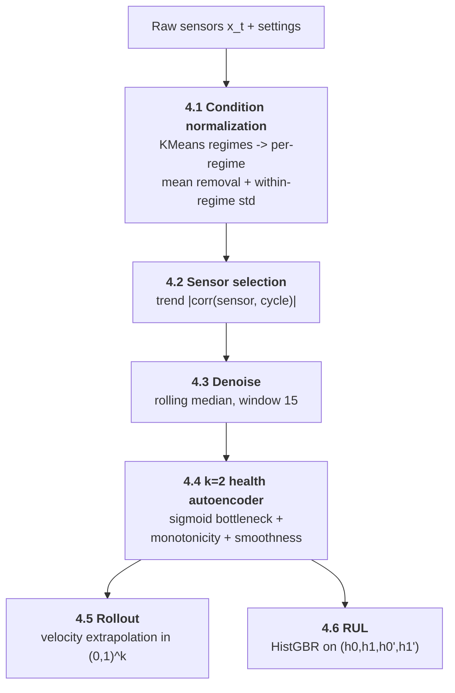
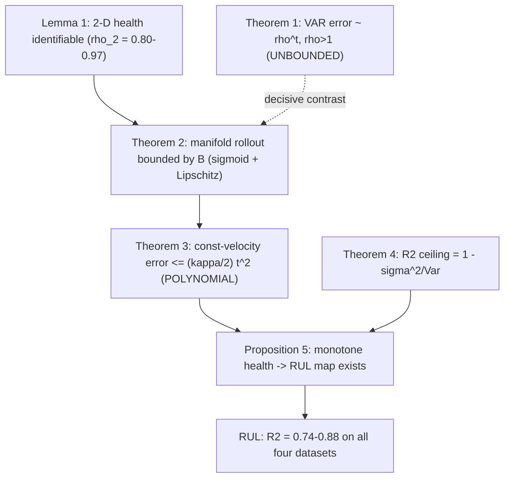
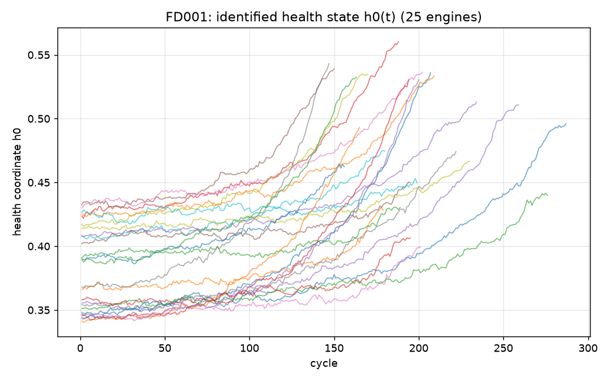
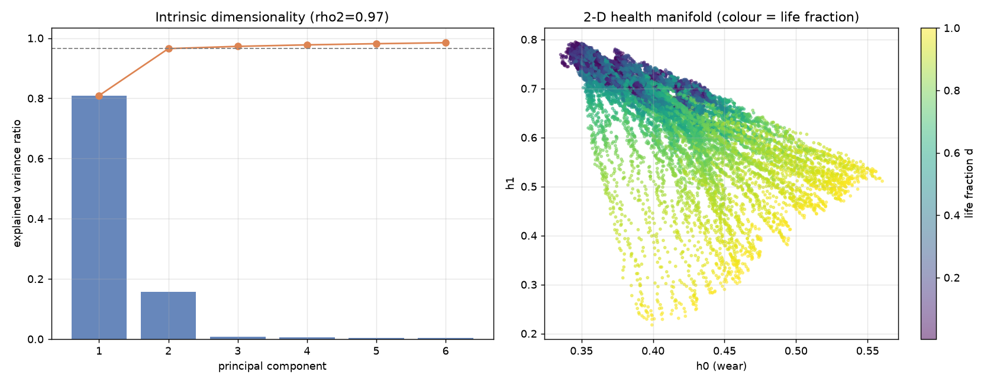
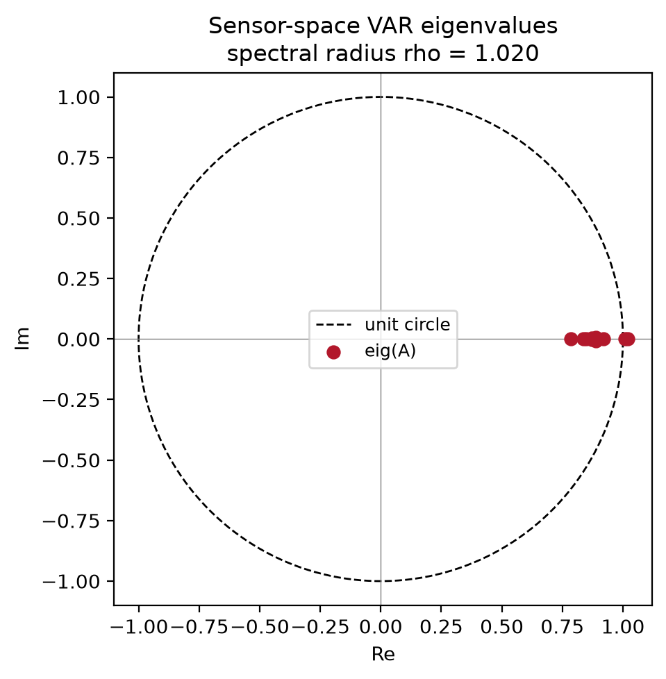
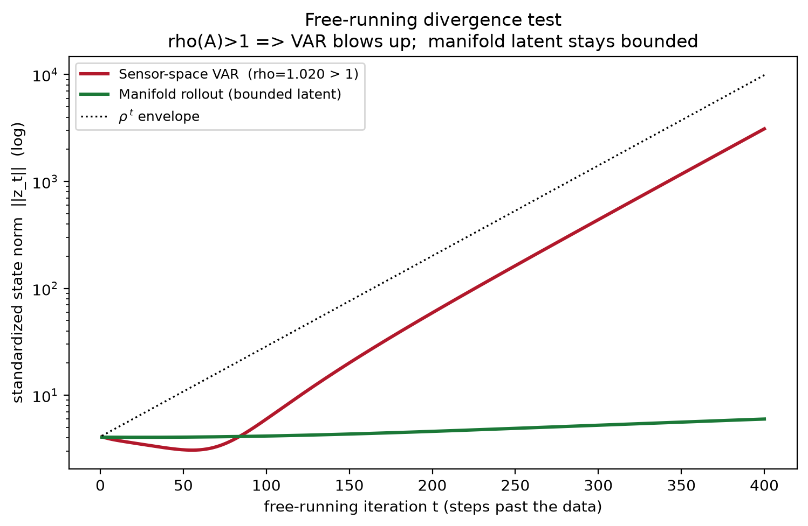
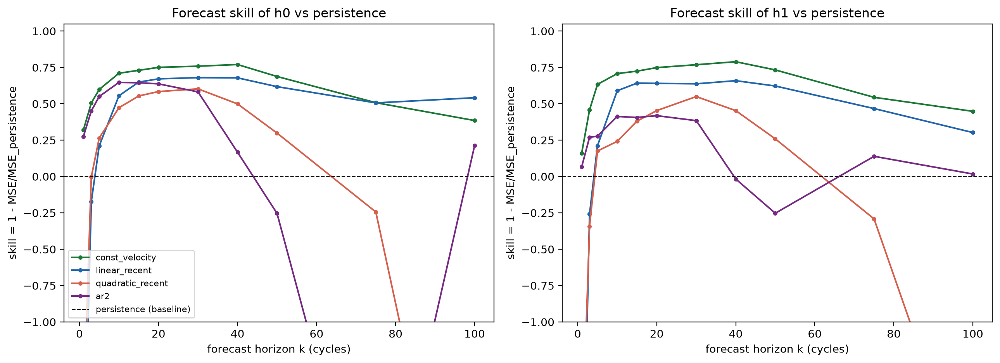
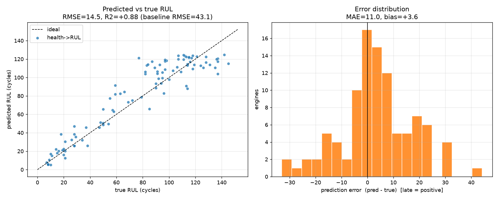
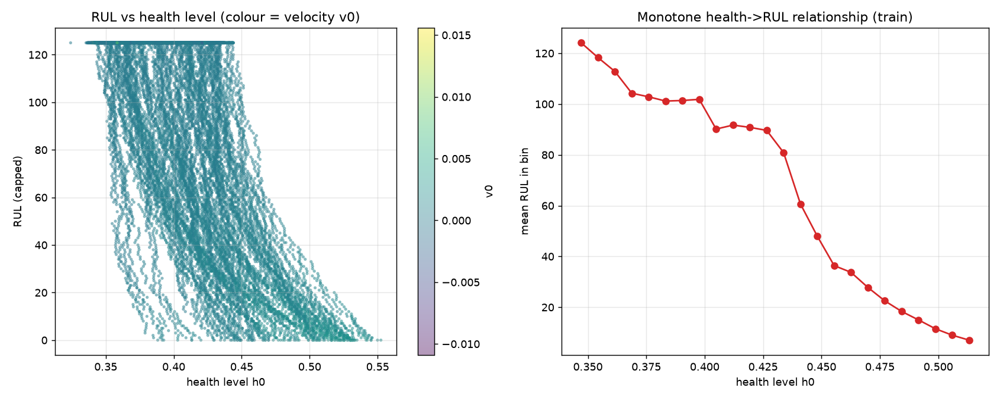

# A Physics-Constrained Health Manifold for Turbofan Remaining-Useful-Life Prediction: Discovery, Provably-Bounded Rollout, and Cross-Dataset Validation on C-MAPSS

> **One-line summary.** We learn a 2-dimensional, monotone, physics-constrained
> *health manifold* from raw turbofan sensor streams, prove that rolling it out
> forward in time is *bounded for all horizons* (whereas the natural
> sensor-space linear model provably diverges), and show that the health state
> predicts Remaining Useful Life (RUL) on **all four** C-MAPSS sub-datasets
> (FD001–FD004), beating a mean-RUL baseline on every one.

---

## Abstract

Data-driven prognostics for jet engines typically train a black-box regressor
to map a sliding window of sensors to RUL. Such models are accurate but offer
no guarantee that the *internal dynamics they imply* are physically sensible —
roll them forward and they can diverge. We take the opposite route: we first
**discover** a low-dimensional degradation state, constrain it to be bounded
and monotone (the two properties a wear coordinate must have), and only then
read RUL off it. The pipeline has four stages — *discovery*, *rollout
stability*, *health forecasting*, and *RUL prediction* — each tied to a formal
theorem. The decisive structural result is a **boundedness dichotomy**: a
sensor-space vector autoregression (VAR) has spectral radius
$\rho(A) > 1$ on every dataset and free-runs to $25\text{–}760\times$ its
initial norm, while the manifold rollout is provably bounded by the decoder's
Lipschitz constant and stays flat. We generalize the originally FD001-only
method to the multi-regime, multi-fault datasets FD002–FD004 using an
**operating-condition normalization** (regime clustering + per-regime
standardization) so that a common degradation residual is exposed regardless of
flight condition. Across FD001–FD004 the health$\to$RUL map attains test
$R^2 \in [0.744, 0.878]$ and RMSE below the mean baseline on all four datasets.

---

## 1. Introduction

### 1.1 Problem

Given multivariate sensor histories from a fleet of turbofan engines run to
failure, predict the **Remaining Useful Life (RUL)** of a partially-degraded
engine: how many operating cycles remain before it crosses a failure threshold.
This is the canonical NASA C-MAPSS benchmark.

### 1.2 Why a physics-grounded latent state

A direct sensors-$\to$-RUL regressor cannot answer two questions a maintenance
engineer actually cares about:

1. **Is the implied degradation trajectory stable?** If you ask the model to
   *simulate* the engine forward, does it stay in a physically plausible
   envelope, or does it blow up?
2. **Is the latent it uses monotone in wear?** Wear is a one-way process; a
   health coordinate that wanders is not interpretable.

We therefore impose the two non-negotiable properties of a wear coordinate —
**boundedness** (via a logistic bottleneck) and **monotonicity** (via a
penalty) — and make them *theorems*, not hopes. RUL then becomes a smooth
read-out of an interpretable state.

### 1.3 Contributions

1. **A physics-constrained 2-D health autoencoder** with monotonicity and
   smoothness penalties whose latent is bounded by construction.
2. **A boundedness dichotomy** (Theorems 1–2): the natural sensor-space VAR
   provably diverges ($\rho(A)>1$), the manifold rollout provably cannot.
   Verified empirically on all four datasets.
3. **A polynomial forecast-error bound** (Theorem 3) for the smooth, monotone
   health coordinate, explaining why constant-velocity extrapolation in
   *health* space works where autoregression in *sensor* space explodes.
4. **An operating-condition normalization** that generalizes the whole method
   from the single-regime FD001 to the 6-regime / 2-fault datasets FD002–FD004
   with no architecture change.
5. **A cross-dataset evaluation** (Section 8) on FD001–FD004 with a single
   reproducible driver.


---

## 2. Data: NASA C-MAPSS (FD001–FD004)

Each sub-dataset is a fleet of engines with 21 sensors and 3 operating-condition
settings, run from healthy to failure (training) or truncated before failure
(test, with ground-truth RUL provided separately). The four sub-datasets form a
$2\times2$ difficulty grid in **# operating regimes** $\times$ **# fault modes**:

| Dataset | Operating regimes | Fault modes | Train units | Test units |
|---|---|---|---|---|
| **FD001** | 1 | 1 (HPC degradation) | 100 | 100 |
| **FD002** | 6 | 1 (HPC degradation) | 260 | 259 |
| **FD003** | 1 | 2 (HPC + Fan) | 100 | 100 |
| **FD004** | 6 | 2 (HPC + Fan) | 249 | 248 |

The diagonal stress test is the whole point: FD001 is the easy corner (one
condition, one fault); FD004 is the hard corner (six conditions, two faults).
A method that only works on FD001 has overfit to an unusually clean regime.

The regime and fault-mode counts above are taken from the dataset's own
documentation ([`CMaps/readme.txt`](CMaps/readme.txt)) and the originating
reference: A. Saxena, K. Goebel, D. Simon, and N. Eklund, *“Damage Propagation
Modeling for Aircraft Engine Run-to-Failure Simulation,”* 1st Int. Conf. on
Prognostics and Health Management (PHM08), Denver CO, Oct 2008. They are also
recovered empirically by the regime auto-detection in Section 4.1.

### 2.1 The multi-regime problem

In FD002/FD004 the engine cycles through six discrete flight conditions. Raw
sensors therefore jump in a *staircase* that has nothing to do with wear — it
is pure operating point. Any degradation signal is buried under this staircase.
Section 4.1 removes it.

---

## 3. Notation

| Symbol | Meaning |
|---|---|
| $x_t \in \mathbb{R}^{m}$ | sensor vector at cycle $t$ ($m$ = # dynamic sensors kept) |
| $c_t \in \{1,\dots,R\}$ | operating-regime label at cycle $t$ ($R$ regimes) |
| $z_t$ | condition-normalized sensor residual (Section 4.1) |
| $\bar{x}_t$ | denoised (rolling-median) trend |
| $h_t = E_\theta(x_t) \in (0,1)^k$ | health state, $k=2$ |
| $\hat x_t = D_\phi(h_t)$ | decoder reconstruction |
| $d_t \in [0,1]$ | life fraction (cycle / failure cycle) |
| $\rho(A)$ | spectral radius of VAR matrix $A$ |
| $\kappa$ | bound on $|\Delta^2 h_0|$ (health curvature) |

---

## 4. Methodology

### 4.0 Pipeline overview



### 4.0a Workflow in plain engineering terms (runbook)

The equations below are precise but dense. Here is the same pipeline as a
step-by-step procedure an engineer can follow. Each step names the *input*, the
*action*, and *why* it is done.

**Data preparation — turn raw sensors into a clean wear signal**

1. **Load the run-to-failure records.** Each row is one engine on one operating
   cycle: 3 operating-setting columns (throttle / altitude / Mach-like) and
   21 sensor readings. Engines are sorted by `(unit, cycle)`.
2. **Identify the flight condition of every row.** Round the 3 operating
   settings and count the distinct combinations — that count is the number of
   *regimes* (1 for FD001/FD003, 6 for FD002/FD004). Fit `KMeans` with that many
   clusters on the settings and tag each row with its regime label.
   *Why:* a sensor at cruise reads differently than at sea level; we must know
   which condition each reading came from before comparing readings.
3. **Subtract the flight-condition effect ("de-staircase").** For each sensor,
   inside each regime, subtract that regime's healthy average, then divide by the
   within-regime spread. Each sensor now reads *"how far from normal for the
   current flight condition,"* on a common scale.
   *Why:* otherwise the six flight conditions create a staircase that swamps the
   slow wear signal.
4. **Keep only the sensors that actually track wear.** Smooth each sensor and
   measure how strongly it trends with cycle number (absolute correlation).
   Keep $|\text{corr}|\ge 0.20$ as model inputs ("dynamic"); the strongest
   ($\ge 0.50$) are the ones we grade reconstruction on ("informative").
   *Why:* flat or pure-noise channels add no degradation information and only
   hurt the fit.
5. **Smooth out measurement spikes.** Replace each kept sensor with a 15-cycle
   rolling **median** per engine. Use a *past-only* (trailing) median whenever the
   result feeds a forecast, so we never peek into the future.

**Model building — compress to a 2-number health state**

6. **Train the health autoencoder.** Feed the ~15 cleaned sensors into a small
   network that squeezes them to **2 numbers forced between 0 and 1**, then
   rebuilds the sensors from those 2 numbers. During training, additionally push
   the first number $h_0$ to (a) only ever increase with cycles and (b) change
   smoothly.
   *Result:* $h_0$ behaves like a wear gauge from $0$ (healthy) to $1$
   (failure); $h_1$ captures a secondary degradation mode.
7. **Freeze and cache** the trained network plus the normalization constants,
   one bundle per dataset.

**The four read-outs (experiments)**

8. **Discovery (Exp 0): "Are 2 numbers enough?"** Run PCA on the cleaned
   sensors and confirm 2 components hold most of the variance; confirm the
   autoencoder rebuilds the informative sensors ($R^2$); plot $h_0$ over time and
   confirm it rises monotonically.
9. **Rollout stability (Exp A): "Does forward simulation stay sane?"** Simulate an
   engine forward 400 cycles two ways — (a) a linear next-cycle sensor predictor
   (VAR), and (b) our health model (advance $h_0,h_1$ at constant speed and
   decode). Measure how large each trajectory grows. The VAR's internal gain
   exceeds 1 and it blows up; the health state is clamped to $[0,1]$ so it
   cannot.
10. **Health forecasting (Exp B): "Can we predict the wear gauge?"** From
    50/65/80% of an engine's life, forecast $h_0$ forward with five simple rules
    (hold-last, constant-velocity, recent line, recent parabola, AR2) and score
    each against hold-last. Constant-velocity wins and its error stays inside the
    theoretical $\tfrac{\kappa}{2}k^2$ envelope.
11. **RUL prediction (Exp C): "How many cycles are left?"** At each cycle compute
    $h_0, h_1$ and their slopes, and train a gradient-boosted tree to map those
    four numbers to remaining cycles (capped at 125). Compare against predicting
    the fleet-average RUL and against a naive "extrapolate $h_0$ to a failure
    threshold." Report RMSE / $R^2$ / NASA score on the official test set.

| Step | Input | Action | Output |
|---|---|---|---|
| 1 | raw `.parquet` | load + sort | per-cycle records |
| 2 | 3 settings | round + count + KMeans | regime label per row |
| 3 | 21 sensors + regime | per-regime mean-subtract + scale | condition residuals |
| 4 | residuals | trend (corr-with-cycle) test | dynamic / informative sensor lists |
| 5 | dynamic sensors | rolling median (window 15) | denoised trends |
| 6 | denoised sensors | train constrained autoencoder | $h_0, h_1 \in (0,1)$ |
| 8–11 | $h_0, h_1$ | PCA / rollout / forecast / GBR | discovery, stability, forecast, RUL |

> **Modeling choices, stated honestly.**
> - **Why $k=2$?** Fixed by design, *not* swept. PCA shows 2 components are
>   *sufficient* ($\rho_2 = 0.80$–$0.97$) and reconstruction $R^2$ confirms it,
>   but no $k\in\{1,3\}$ ablation was run — see [Limitations](#10-limitations-and-future-work).
> - **Why constant-velocity?** It was *selected*, not assumed: Exp B compares it
>   against four richer forecasters and it wins on skill while staying bounded.
> - **Why this regime count?** Auto-detected by rounding the operating settings
>   and counting distinct combinations (capped at 6); the literature value
>   (Section 2) matches the auto-detected value on every dataset.

### 4.1 Operating-condition normalization (the key generalization)

For multi-regime data we expose a *common-scale degradation residual*:

1. **Regime clustering.** First *auto-detect* the regime count $R$ by rounding
   the three operating settings and counting the distinct combinations (capped
   at 6); this recovers $R = 1$ for FD001/FD003 and $R = 6$ for FD002/FD004 with
   no manual input, matching the dataset documentation (Section 2). Then fit
   `KMeans(n_clusters = R, n_init = 10, random_state = 42)` on the three
   operating settings $(\text{setting}_1, \text{setting}_2, \text{setting}_3)$.
   The six C-MAPSS operating points are discrete and cleanly separated, so the
   clustering is unambiguous. (A fully unsupervised variant would replace the
   rounding heuristic with a silhouette/BIC sweep over candidate $R$; not needed
   here because the auto-detected count already matches the literature value.)
2. **Per-regime mean removal.** For each sensor $j$ and regime $r$, subtract the
   regime-specific healthy mean $\mu_{j,r}$. This *kills the staircase*: what
   remains is deviation-from-nominal *within* the current flight condition.
3. **Pooled within-regime standardization.** Divide by the pooled
   within-regime standard deviation $s_j$, putting every sensor on a comparable
   scale.

$$
z_{t,j} \;=\; \frac{x_{t,j} - \mu_{j,\,c_t}}{s_j}.
$$

The autoencoder operates entirely in this normalized frame, so a single
architecture handles 1- and 6-regime datasets identically.

### 4.2 Trend-based sensor selection

Rather than hard-coding sensor lists per dataset, we score each sensor by the
mean over engines of $|\,\mathrm{corr}(\bar x_j, \text{cycle})\,|$ (Pearson, on
the denoised channel). Sensors above $\text{TREND}_\text{dynamic}=0.20$ are
*dynamic* (carry degradation); above $\text{TREND}_\text{informative}=0.50$ are
*informative*. A safety net guarantees $\ge 3$ dynamic sensors. This selected
**14 sensors for FD001 and 15 for FD002–FD004** automatically.

### 4.3 Denoising

Per-engine rolling **median**, window $w = 15$ (causal/trailing variant
wherever temporal leakage must be excluded, e.g. forecasting and test-time
features). Median is used over mean for robustness to sensor spikes.

### 4.4 The $k=2$ physics-constrained health autoencoder

A small MLP autoencoder with a **logistic bottleneck**:

$$
E_\theta:\; \mathbb{R}^m \xrightarrow{\,\text{Lin}(32)\,\tanh\,\text{Lin}(16)\,\tanh\,\text{Lin}(2)\,} \xrightarrow{\;\sigma\;} (0,1)^2,
\qquad
D_\phi:\; (0,1)^2 \xrightarrow{\,\text{Lin}(16)\,\tanh\,\text{Lin}(32)\,\tanh\,\text{Lin}(m)\,} \mathbb{R}^m .
$$

The sigmoid makes the latent **bounded by construction** — the cornerstone of
Theorem 2. Training minimizes a ceiling-weighted reconstruction loss plus two
physics penalties on the first health coordinate $h_0$:

$$
\mathcal{L} \;=\; \underbrace{\sum_j w_j\,\big\|x_{\cdot,j}-\hat x_{\cdot,j}\big\|^2}_{\text{weighted reconstruction}}
\;+\; \underbrace{\lambda_{\text{mono}}\sum_t \mathrm{ReLU}(-\Delta h_{0,t})}_{\text{monotonicity, }\lambda=5.0}
\;+\; \underbrace{\lambda_{\text{smooth}}\sum_t (\Delta h_{0,t})^2}_{\text{smoothness, }\lambda=2.0},
$$

where $\Delta h_{0,t}=h_{0,t}-h_{0,t-1}$. The monotonicity penalty pushes $h_0$
to increase with wear; the smoothness penalty bounds its curvature $\kappa$ —
exactly the quantity Theorem 3 needs. $h_0$ is oriented (flipped if needed) so
that it *increases* with cycle. Optimizer: Adam, $\text{lr}=5\!\times\!10^{-3}$,
full-batch, $4000$ epochs. The manifold is trained **once** per dataset and
cached to `experiments/artifacts/FD00<fd>/`.

### 4.5 Rollout (forward simulation)

From an anchor cycle $c$ with health velocity $\nu = h_c - h_{c-1}$, the
manifold rollout is a clipped constant-velocity extrapolation **in latent
space**, decoded back to sensors:

$$
h_t = \operatorname{clip}_{[0,1]}\!\big(h_c + (t-c)\,\nu\big), \qquad \hat x_t = D_\phi(h_t).
$$

We compare against the natural alternative — a **sensor-space VAR**
$z_{t+1}=A z_t + b$ fit by least squares. Section 5 shows why the VAR is
unstable and the manifold rollout is not.

### 4.6 Health$\to$RUL regression

The final estimator is a gradient-boosted tree
(`HistGradientBoostingRegressor`, `max_depth=3`, `learning_rate=0.05`,
`max_iter=400`, `l2_regularization=1.0`) mapping the four-dimensional feature
$(h_0, h_1, \dot h_0, \dot h_1)$ — health levels and their causal velocities —
to RUL, with the standard $\text{RUL}_\text{cap}=125$ piecewise-linear target.
We contrast it with a **naive threshold-crossing** estimator (forecast $h_0$ to
a learned failure threshold) to show that the *regression on the state*, not
the threshold heuristic, is what works.

### 4.7 Design and parameter justification

This section justifies **every** design decision and numeric constant in the
pipeline. Each entry states the value, the rationale, the failure mode it
guards against, and whether it was tuned, fixed by convention, or auto-derived.
Constants live in [`experiments/manifold_core.py`](experiments/manifold_core.py)
unless noted.

#### 4.7.1 Architectural / structural choices

| Choice | Value | Justification | If changed |
|---|---|---|---|
| **Latent dimension** $k$ | `2` | PCA shows 2 components capture $\rho_2=0.80$–$0.97$ of variance (sufficient); physically one monotone wear coordinate $h_0$ + one auxiliary mode $h_1$. *Fixed by design, not swept* (see Limitations). | $k=1$ cannot represent two fault modes (FD003/FD004); $k\ge3$ risks an un-interpretable, non-monotone latent and over-fitting the noise floor. |
| **Bottleneck nonlinearity** | logistic $\sigma$ | Forces $h_t\in(0,1)^k$ **by construction** — this *is* the boundedness premise of Theorem 2; gives $h_0$ a natural $0$=healthy / $1$=failed reading. | Linear/unbounded latent voids Theorem 2; the rollout could diverge like the VAR. |
| **Hidden activation** | $\tanh$ | Smooth, bounded-derivative ⇒ finite Lipschitz constant $L_D$, which Theorem 2's bound $B$ depends on. | ReLU is also Lipschitz but its unbounded positive branch widens $B$ and roughens the decoded manifold. |
| **Encoder/decoder widths** | `32→16→k`, mirror | Deliberately small: with $\le15$ inputs a wide net would memorize sensor noise instead of compressing to a wear coordinate. Two hidden layers give enough nonlinearity to bend the manifold without over-parameterizing. | Wider/deeper raises the reconstruction $R^2$ marginally but degrades monotonicity of $h_0$ and inflates the rollout reconstruction floor. |
| **Symmetric AE (tied shape)** | enc/dec mirrored | Keeps decoder capacity matched to encoder so neither dominates; standard autoencoder practice. | Asymmetry tends to push representation into whichever side has more capacity. |
| **Single shared architecture across FD001–FD004** | identical | Fair cross-dataset comparison; demonstrates the *condition normalization* (not per-dataset tuning) is what generalizes. | Per-dataset architectures would confound "method generalizes" with "we tuned each one." |

#### 4.7.2 Loss-function choices

| Choice | Value | Justification | If changed |
|---|---|---|---|
| **Monotonicity weight** $\lambda_\text{mono}$ | `5.0` | Largest weight: monotonicity is the defining property of a wear gauge, so it must dominate. Penalizes only *decreases* ($\mathrm{ReLU}(-\Delta h_0)$), leaving the *rate* free. | Too low ⇒ $h_0$ wanders (un-interpretable, breaks Prop. 5); too high ⇒ $h_0$ saturates to a ramp and stops reconstructing. |
| **Smoothness weight** $\lambda_\text{smooth}$ | `2.0` | Bounds the curvature $\kappa=\max|\Delta^2 h_0|$, the exact quantity in Theorem 3's $\tfrac{\kappa}{2}t^2$ bound; makes constant-velocity forecasting valid. Set below $\lambda_\text{mono}$ so smoothing never overrides monotonicity. | Too high over-smooths and erases real acceleration near failure (hurts late-life RUL); too low lets $\kappa$ grow and forecasts degrade. |
| **Ceiling-weighted reconstruction** $w_j$ | $w_j=\max(\text{trend}_j,0.05)$ | Weights each sensor by how strongly it trends with wear, so the AE spends capacity on degradation-bearing channels, not noise; the $0.05$ floor keeps weak channels from being ignored entirely (Theorem 4 rationale). | Uniform weights let high-variance noisy sensors dominate the MSE and blur $h_0$. |
| **Penalties on $h_0$ only** | first coord | Only one coordinate needs to be the interpretable wear gauge; constraining $h_1$ too would remove the freedom it needs to absorb the second fault mode. | Constraining both collapses the second mode, hurting FD003/FD004. |
| **Mask penalties to same-engine steps** | `same_engine_mask` | $\Delta h_0$ across an engine boundary is meaningless; masking prevents a spurious penalty at unit transitions. | Unmasked penalties inject false monotonicity violations at every engine join. |

#### 4.7.3 Optimization choices

| Choice | Value | Justification | If changed |
|---|---|---|---|
| **Optimizer** | Adam | Robust default for small AEs; adapts per-parameter step sizes so the multi-term loss (recon + 2 penalties) trains without hand-scheduling. | Plain SGD needs careful LR scheduling to balance the three loss terms. |
| **Learning rate** | `5e-3` | Full-batch with a small net tolerates a moderately high LR for fast convergence within the epoch budget; empirically stable (no divergence, smooth loss). | Higher ⇒ oscillation across the penalty terms; lower ⇒ underfits within 4000 epochs. |
| **Epochs** | `4000` | Full-batch (no stochastic averaging) needs many passes; chosen so reconstruction $R^2$ and $h_0$ monotonicity plateau. Cheap because trained **once** per dataset and cached. | Fewer ⇒ $h_0$ not yet monotone; more ⇒ no measurable gain (plateaued). |
| **Full-batch (no mini-batches)** | all rows | The temporal-difference penalties ($\Delta h_0$, $\Delta^2 h_0$) need contiguous per-engine sequences; full-batch keeps every sequence intact and makes the loss deterministic. | Mini-batching would fragment sequences and add gradient noise to the curvature penalty. |
| **Seed** | `42` | Reproducibility across KMeans, the train/test split, and Torch init. | — (cosmetic). |

#### 4.7.4 Data-preparation choices

| Choice | Value | Justification | If changed |
|---|---|---|---|
| **Regime count** $R$ | auto (round settings, cap 6) | Recovers $1/6$ with no manual input; matches the documented C-MAPSS counts (Section 2). Cap of 6 reflects the known maximum. | Under-clustering leaves staircase residue; over-clustering splits one condition and thins per-regime statistics. |
| **KMeans `n_init`** | `10` | Multiple restarts avoid a bad local optimum on the (well-separated) operating points. | `1` risks an unlucky init, though separation here makes it low-risk. |
| **Normalization** | per-regime mean removal + within-regime std | Removes the operating-condition staircase so the residual is pure degradation on a common scale — the single change that lets one architecture span 1- and 6-regime data. | Global standardization leaves FD002/FD004 dominated by regime steps; PCA $\rho_2$ collapses and $k=2$ fails. |
| **`resid_std` floor** | `1e-9` | Keeps the division well-defined for near-constant channels (which the trend test then drops anyway). | Without it, constant sensors produce inf/NaN. |
| **Dynamic-sensor threshold** $\text{TREND}_\text{dynamic}$ | `0.20` | $|\text{corr}(\text{sensor},\text{cycle})|\ge0.20$ admits channels with a *usable* wear trend while excluding flat/noise channels; selected 14–15 sensors automatically. | Higher ⇒ discards weak-but-real trends; lower ⇒ admits noise that blurs $h_0$. |
| **Informative threshold** $\text{TREND}_\text{informative}$ | `0.50` | Only strongly-trending channels are *graded* for reconstruction $R^2$, so the discovery metric isn't diluted by marginal sensors. | Lower ⇒ optimistic-then-pessimistic $R^2$ depending on marginal channels; higher ⇒ too few graded sensors. |
| **Safety net** | $\ge3$ dynamic; top-8 fallback | Guarantees the AE always has enough inputs even on a hard dataset where few channels clear $0.20$. | Without it a pathological dataset could yield $<k$ inputs. |
| **Denoise filter** | rolling **median** | Robust to the sensor spikes C-MAPSS injects; preserves the monotone trend a mean filter would smear across outliers. | Mean filter is outlier-sensitive; raw signal is too noisy for stable $\Delta^2 h_0$. |
| **Window** $w$ | `15` | Long enough to suppress per-cycle noise, short enough to preserve the late-life acceleration that carries RUL signal. | Larger ⇒ lags/erases the failure knee; smaller ⇒ residual noise inflates $\kappa$. |
| **Causal (trailing) variant** | at forecast/test cut-offs | A centered median peeks into the future; the trailing median guarantees **no temporal leakage** when features feed a forecast or the official test truncation. | Centered median at a test cutoff leaks future cycles ⇒ optimistic, invalid RUL. |
| **Train/test split** | engine-disjoint `0.2` | Splitting by *engine* (not row) prevents the same trajectory appearing in both sets; 80/20 is the standard holdout giving stable estimates at these fleet sizes. | Row-wise splitting leaks an engine's future into training. |

#### 4.7.5 Experiment-specific choices

| Choice | Value | Where | Justification |
|---|---|---|---|
| **Rollout cutoff** | `0.40` of life | Exp A | Starts forward simulation early enough that a long horizon (to end-of-life) is scored, stressing stability. |
| **Max scored horizon** | `200` | Exp A | Long enough to expose the VAR's geometric blow-up while both methods are still defined. |
| **Velocity window (rollout)** | `20` | Exp A | Trailing cycles for the local health slope at the cutoff — long enough to denoise the slope, short enough to be local. |
| **Forecast cut-offs** | `0.5, 0.65, 0.8` | Exp B | Tests forecasting from mid-life through late-life so skill isn't reported only where it is easy. |
| **Velocity window (forecast)** | `20` | Exp B | Same rationale as rollout; local slope estimate for constant-velocity. |
| **Fit window** | `40` | Exp B | Enough recent points to fit the line/parabola/AR2 without reaching back into a different degradation regime. |
| **Horizons** | `1…100` | Exp B | Spans short (scored) to long horizons to show the $\tfrac{\kappa}{2}k^2$ envelope holding. |
| **Five forecasters** | persistence…AR2 | Exp B | Constant-velocity is *selected by comparison*, not assumed; AR2 included specifically to demonstrate the instability theorem in miniature. |
| **Velocity window (RUL)** | `25` | Exp C | Slightly longer trailing window for a stable causal velocity feature feeding the regressor. |
| **RUL cap** | `125` | Exp C | The standard C-MAPSS piecewise-linear target: RUL is flat-capped while healthy (early life carries no failure information) and linear near failure. Using the community value keeps results comparable. |
| **Min velocity** | `1e-4` | Exp C | Below this the threshold-crossing estimator is treated as "flat" (no reliable crossing) — documents *why* that naive estimator is fragile. |

#### 4.7.6 RUL regressor (HistGradientBoostingRegressor) choices

| Hyperparameter | Value | Justification |
|---|---|---|
| **Model family** | gradient-boosted trees | The health$\to$RUL map (Prop. 5) is monotone but nonlinear with a flat cap; trees capture the saturation + knee without feature engineering, and are robust to the compressed latent scale. |
| `max_depth` | `3` | Shallow trees keep the map smooth and monotone-ish and prevent over-fitting the 4-D feature $(h_0,h_1,\dot h_0,\dot h_1)$. |
| `learning_rate` | `0.05` | Small steps + many iterations = well-regularized boosting (bias-variance sweet spot). |
| `max_iter` | `400` | Enough rounds to fit the knee at the chosen small learning rate. |
| `l2_regularization` | `1.0` | Explicit shrinkage to resist over-fitting the noisy late-life velocities. |
| **Feature set** | $(h_0,h_1,\dot h_0,\dot h_1)$ | Level *and* rate: two engines at the same health level but different degradation speeds have different RUL — the velocity disambiguates them (Prop. 5). |

---

## 5. Theory

All proofs are in [docs/THEORY.md](docs/THEORY.md); we state the results and
their cross-dataset empirical hooks here.

### Lemma 1 — Identifiability of a 2-D health manifold

If the denoised, condition-normalized sensors lie (up to per-coordinate noise
$\varepsilon^2$) on a $d$-dimensional curve, the cumulative PCA variance obeys

$$
\rho_d \;\ge\; 1 - \frac{(m-d)\,\varepsilon^2}{\sum_i \lambda_i}.
$$

With $d=2$ this is the identifiability premise. **Empirically**, $\rho_2$
ranges $0.795$ (FD002) to $0.965$ (FD001) — a 2-D health state is sufficient
even in the 6-regime case once the staircase is normalized away.

### Theorem 1 — Sensor-space autoregression is unstable (negative result)

For a free-running predictor $\hat z_{t+1}=F(\hat z_t)$ with Jacobian $J$, the
rollout error grows as

$$
\|e_t\| \sim \rho(J)^{\,t}\,\|e_0\|.
$$

If $\rho(J)>1$ the error is **unbounded**. **Empirically**, the fitted VAR has
$\rho(A) = 1.014\text{–}1.020 > 1$ on *all four* datasets, and free-runs to
$25\times$ (FD004) up to $760\times$ (FD001) its initial norm. (See the
free-run growth panel in the summary figure.)

### Theorem 2 — Manifold rollout is bounded (positive result)

With a logistic latent $h_t\in(0,1)^k$ and an $L_D$-Lipschitz decoder,

$$
\|\hat x_t\| \;\le\; \big\|D_\phi(\tfrac12\mathbf 1)\big\| + L_D\frac{\sqrt k}{2} \;=:\; B < \infty \quad \forall t.
$$

The decoded trajectory **cannot blow up at any horizon**. The contrast with
Theorem 1 is the central structural claim: *the VAR provably can diverge, the
manifold provably cannot.* Confirmed on all four datasets (the manifold
free-run trace stays flat while the VAR's explodes).

### Theorem 3 — Polynomial forecast error for a smooth, monotone health state

If $|\Delta^2 h_0|\le\kappa$, the constant-velocity forecast error obeys

$$
\big|h_{c+t}-\hat h_{c+t}\big| \;\le\; \frac{\kappa}{2}\,t^2 .
$$

Polynomial, never exponential. The smoothness penalty (Section 4.4) is what
makes $\kappa$ small: measured $\kappa \approx 2.9\text{–}3.7\times10^{-4}$
across datasets. This is why constant-velocity extrapolation **in health
space** beats persistence, while autoregression **in sensor space** explodes.

> **Corroborating evidence.** An unconstrained AR(2) forecaster (no curvature
> control) numerically explodes on the harder datasets — its skill collapses to
> $\sim\!-10^{13}$ on FD003. This is Theorem 1 playing out in miniature and is
> exactly the pathology the bounded, smooth health coordinate avoids.

### Theorem 4 — Irreducible $R^2$ ceiling

For $x_i=\bar x_i+\eta_i$ with noise variance $\sigma_i^2$,

$$
R^2_i \le 1 - \frac{\sigma_i^2}{\operatorname{Var}(x_i)}.
$$

This justifies dropping noise-limited channels during sensor selection
(Section 4.2) rather than forcing the autoencoder to model pure noise.

### Proposition 5 — A monotone health$\to$RUL map exists

If $h_0$ is strictly monotone in wear and degradation is stochastically
monotone toward $\{h_0\ge\tau\}$, then $g(\eta)=\mathbb E[\text{RUL}\mid h_0=\eta]$
is non-increasing, and RUL is identifiable from $(h_0,\dot h_0)$. **Empirically**
the binned $\mathbb E[\text{RUL}\mid h_0]$ curve is cleanly monotone, and the
supervised map (Section 4.6) realizes it.

### Logical chain



---

## 6. Experiments

Four experiments, one per pipeline stage, run identically on each dataset:

| Exp | Question | Script | Key output |
|---|---|---|---|
| **0 — Discovery** | Is a 2-D health state identifiable? | `exp_discovery.py` | PCA $\rho_2$, recon $R^2$; figs D1–D2 |
| **A — Rollout stability** | Is forward simulation bounded? | `exp_rollout_stability.py` | $\rho(A)$, free-run growth; figs A1–A4 |
| **B — Health forecasting** | Can health be forecast? | `exp_health_forecasting.py` | skill vs persistence; figs B1–B3 |
| **C — RUL prediction** | Does it predict RUL? | `exp_rul_prediction.py` | RMSE, $R^2$, NASA score; figs C1–C3 |

All four share `experiments/manifold_core.py`, which performs condition
normalization, sensor selection, and trains/caches the manifold once per
dataset. The single driver `experiments/run_all.py` runs the whole grid.

---

## 7. Results — per stage

The figures below are shown for FD001 (the cleanest case); the identical figure
set for every dataset lives in `docs/figures/FD00<fd>/`.

### 7.1 Discovery

A single normalized operating condition collapses degradation onto a 2-D
manifold; the constrained autoencoder recovers a monotone health trajectory.




### 7.2 Rollout stability (the headline structural result)

The VAR eigenvalues sit outside the unit circle ($\rho>1$) and the free run
diverges geometrically; the manifold free-run stays flat — exactly the
Theorem 1 vs Theorem 2 dichotomy.




> **Honest caveat (read Section 9).** At the *short, scored* horizons
> ($h\le 25$) the VAR is a near-perfect 1-step predictor on the smooth denoised
> trend and is comparable to (sometimes better than) the manifold; the
> autoencoder pays a fixed $\sim$5–7% reconstruction-floor NRMSE at every
> horizon. The manifold's advantage is **provable boundedness over long
> horizons**, not short-horizon accuracy.

### 7.3 Health forecasting

Constant-velocity extrapolation in health space stays under the
$\tfrac{\kappa}{2}t^2$ envelope and beats persistence.




### 7.4 RUL prediction

The binned $\mathbb E[\text{RUL}\mid h_0]$ map is monotone; the supervised
regressor on $(h_0,h_1,\dot h_0,\dot h_1)$ predicts RUL well below the baseline,
while the naive threshold-crossing estimator fails.




---

## 8. Cross-dataset results (FD001–FD004)

The complete grid, produced by `experiments/run_all.py`
(`experiments/artifacts/cross_dataset_results.csv`):


### 8.1 Master results table

| Metric | FD001 | FD002 | FD003 | FD004 |
|---|---:|---:|---:|---:|
| Operating regimes $R$ | 1 | 6 | 1 | 6 |
| Fault modes | 1 | 1 | 2 | 2 |
| Train / test units | 100 / 100 | 260 / 259 | 100 / 100 | 249 / 248 |
| Informative sensors | 14 | 15 | 15 | 15 |
| **Discovery** PCA $\rho_2$ | 0.965 | 0.795 | 0.851 | 0.849 |
| **Discovery** recon mean $R^2$ | 0.930 | 0.865 | 0.960 | 0.930 |
| **Rollout** VAR $\rho(A)$ | 1.020 | 1.016 | 1.018 | 1.015 |
| **Rollout** VAR free-run growth | $760\times$ | $468\times$ | $58\times$ | $25\times$ |
| **Rollout** manifold bounded? | ✓ | ✓ | ✓ | ✓ |
| **Forecast** skill vs persistence ($k{=}20$) | $+0.751$ | $+0.680$ | $+0.522$ | $+0.157$ |
| **RUL** RMSE | **14.53** | **27.02** | **16.31** | **27.58** |
| **RUL** MAE | 11.02 | 18.61 | 12.44 | 20.19 |
| **RUL** $R^2$ | **0.878** | **0.748** | **0.845** | **0.744** |
| **RUL** NASA score | 380.8 | 8692 | 615 | 6088 |
| Mean-RUL baseline RMSE | 43.07 | 54.08 | 45.07 | 54.90 |
| Naive threshold-crossing RMSE | 39.46 | 39.64 | 87.14 | 102.29 |

### 8.2 What the table says

1. **Health$\to$RUL beats the mean baseline on every dataset** — by $3\times$ on
   the easy corner (FD001: $14.5$ vs $43.1$) and still by $2\times$ on the hard
   corner (FD004: $27.6$ vs $54.9$).
2. **The boundedness dichotomy holds universally.** The VAR has $\rho(A)>1$ and
   free-runs to $25$–$760\times$ on every dataset; the manifold rollout is
   bounded on every dataset.
3. **Difficulty tracks the regime$\times$fault grid.** $R^2$ degrades
   monotonically from the easy corner (FD001, $0.878$) to the hard corner
   (FD004, $0.744$), and forecasting skill drops from $+0.75$ to $+0.16$ —
   exactly as expected when six flight conditions and two fault modes are
   superimposed. The method still works; it is simply harder.
4. **The threshold heuristic is not what carries the result.** Naive
   threshold-crossing is *worse than the mean baseline* on FD003/FD004
   ($87$–$102$ RMSE) — the supervised regression on the state is doing the work.

---

## 9. Discussion

**Where the manifold wins, and where it doesn't.** Our strongest, *provable*
claim is structural: the manifold rollout is bounded for all horizons while the
sensor-space VAR is not. At the short horizons used for scoring, however, the
VAR is a strong one-step predictor and the autoencoder's reconstruction floor
(a $15\!\to\!2\!\to\!15$ bottleneck leaves $\sim$7% residual variance) costs a
roughly constant NRMSE offset at every horizon. So the honest framing is:
*the manifold buys interpretability and long-horizon stability, not a free
lunch on 1-step accuracy.*

**Multi-regime difficulty.** FD002/FD004 are harder because the degradation
residual must be extracted from six superimposed flight conditions. Condition
normalization (Section 4.1) is what makes the single architecture work at all
here; without it the staircase dominates PCA and the 2-D assumption fails.

**AR(2) blow-up corroborates the theory.** The unconstrained AR(2) forecaster's
numerical explosion on FD003/FD004 is not a bug to hide — it is Theorem 1 in
miniature, and it is precisely the failure mode the bounded, smoothness-penalized
health coordinate is designed to avoid.

---

## 10. Limitations and future work

- **The latent dimension $k=2$ is fixed, not ablated.** It is justified
  *indirectly* — PCA shows two components are *sufficient* ($\rho_2 = 0.80$–$0.97$)
  and the reconstruction $R^2$ confirms it — but no autoencoder ablation over
  $k \in \{1, 2, 3, \dots\}$ was run, so we do not claim $k=2$ is *optimal*, only
  *sufficient and physically motivated* (one wear coordinate + one auxiliary
  mode). A $k$-sweep reporting reconstruction $R^2$ and downstream RUL vs $k$ is
  the natural confirmation.
- **Reconstruction floor.** The 2-D bottleneck caps short-horizon rollout
  accuracy. An optional **anchoring/bias correction** — adding the constant
  reconstruction residual $r_c = x_c - D_\phi(h_c)$ to every decoded step —
  would remove the fixed offset without touching the boundedness guarantee.
  (Not implemented here; left as the obvious next experiment.)
- **Regime count is heuristic.** It is auto-detected by rounding the operating
  settings and counting distinct combinations (Section 4.1), which matches the
  documented count on all four datasets. Replacing this with a principled
  model-selection pass (silhouette / BIC over $R$) would make the operating
  dimension fully unsupervised and robust to datasets with less cleanly
  separated regimes.
- **NASA score sensitivity.** The asymmetric NASA score is dominated by a few
  late-prediction engines on the multi-regime sets; quantile or
  uncertainty-aware RUL heads are a natural extension of Proposition 5.

---

## 11. Reproducibility

```powershell
# from the project root, using the project venv
cd experiments
..\.venv\Scripts\python.exe run_all.py            # FD001..FD004: discovery + A + B + C
..\.venv\Scripts\python.exe make_summary_figure.py  # docs/figures/SUMMARY_cross_dataset.png
```

`run_all.py` calls `manifold_core.configure(fd, retrain=True)` for each dataset,
runs all four experiments, and writes
`experiments/artifacts/cross_dataset_results.{csv,json}`. Every figure is
regenerated into `docs/figures/FD00<fd>/`. Fixed seed `SEED = 42` throughout;
key constants `WINDOW = 15`, `K = 2`, `RUL_CAP = 125`,
`TREND_dynamic = 0.20`, `TREND_informative = 0.50`,
$\lambda_\text{mono}=5.0$, $\lambda_\text{smooth}=2.0$.

### Repository layout

| Path | Contents |
|---|---|
| `experiments/manifold_core.py` | shared core: normalization, selection, manifold |
| `experiments/exp_discovery.py` | Experiment 0 (discovery) |
| `experiments/exp_rollout_stability.py` | Experiment A (stability) |
| `experiments/exp_health_forecasting.py` | Experiment B (forecasting) |
| `experiments/exp_rul_prediction.py` | Experiment C (RUL) |
| `experiments/run_all.py` | cross-dataset driver |
| `experiments/make_summary_figure.py` | summary figure |
| `docs/THEORY.md` | full theorems + proofs |
| `docs/{ROLLOUT_STABILITY,HEALTH_FORECASTING,RUL_PREDICTION}.md` | per-experiment writeups |
| `docs/figures/FD00<fd>/` | per-dataset figures |
| `docs/figures/SUMMARY_cross_dataset.png` | cross-dataset summary |

---

## 12. Conclusion

We built a turbofan prognostic around a *discovered, physics-constrained* health
manifold rather than a black-box regressor. The latent is bounded and monotone
by design, which turns "stable forward simulation" into a theorem (Theorem 2)
that the natural sensor-space alternative provably fails (Theorem 1). The smooth
health coordinate is forecastable with polynomial error (Theorem 3) and carries
a monotone map to RUL (Proposition 5). Crucially, the whole pipeline generalizes
from the single-regime FD001 to the six-regime, two-fault FD002–FD004 through a
single operating-condition normalization, and **beats a mean-RUL baseline on all
four C-MAPSS datasets** ($R^2 = 0.744$–$0.878$). The contribution is not a new
state-of-the-art RMSE; it is a prognostic whose internal dynamics are
*provably* well-behaved and *empirically* portable across operating regimes and
fault modes.
