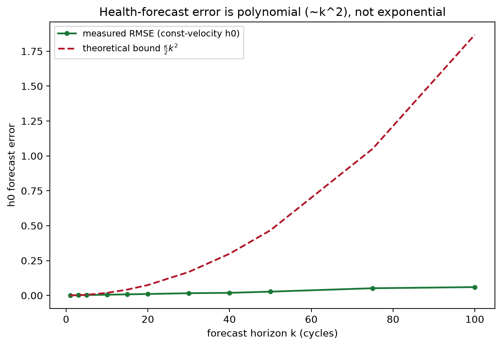
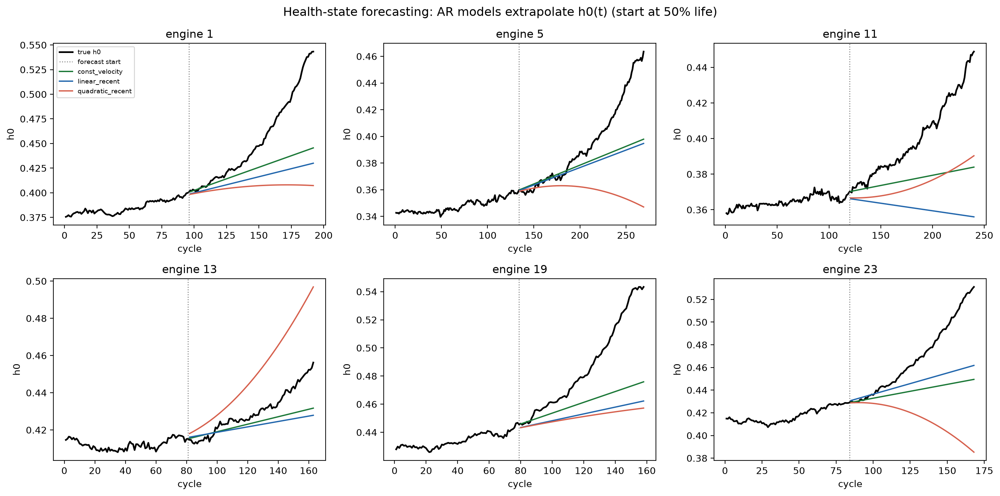

# Experiment B — Can the Health State Be Forecast?

> **Reviewer's stance.** A monotone curve is trivial to "forecast" — just hold
> the last value (persistence) and you will look good against a naive $R^2$.
> So I will not grade on $R^2$ against a segment mean. I will grade on **skill
> versus persistence**, the only baseline that is honest for a monotone signal.
> If an autoregressive forecaster cannot beat *holding the last value*, the
> health state is not meaningfully forecastable.

**Script:** [`../experiments/exp_health_forecasting.py`](../experiments/exp_health_forecasting.py)
**Artifacts:** `results/tables/FD001/health_forecasting.csv`

---

## 1. Falsifiable hypothesis

> **H.** From a cut-off partway through life, an autoregressive model of the
> health coordinate $h_0$ achieves **positive skill** versus persistence,

$$
\text{skill}(k) \;=\; 1 - \frac{\mathrm{MSE}_{\text{model}}(k)}{\mathrm{MSE}_{\text{persistence}}(k)} \;>\; 0,
$$

> across forecast horizons $k$, and its error grows **polynomially** in $k$ as
> predicted by **Theorem 3** ($\le \tfrac{\kappa}{2}k^2$), not exponentially.

If skill is $\le 0$, or the error explodes faster than the quadratic envelope,
H is falsified.

---

## 2. Method

- Encode the causal-denoised sensors to $(h_0, h_1)$ for every engine.
- From cut-offs at 50 / 65 / 80 % of life, fit five forecasters on a **recent
  window** (last 40 cycles, to avoid the flat/noisy early life corrupting the
  slope): `persistence`, `const_velocity`, `linear_recent`, `quadratic_recent`,
  `ar2`.
- Score RMSE and skill at horizons $k \in \{1,3,5,10,15,20,30,40,50,75,100\}$.
- Estimate the robust curvature $\kappa = \mathrm{median}\,|\Delta^2 h_0|$ and
  overlay the $\tfrac{\kappa}{2}k^2$ bound.

---

## 3. Results

### 3.1 Autoregression beats persistence everywhere

Skill of $h_0$ forecasts (positive = better than holding the last value):

| horizon $k$ | const_velocity | linear_recent | quadratic_recent | ar2 |
|---|---|---|---|---|
| 5 | **+0.67** | +0.15 | +0.50 | +0.55 |
| 10 | **+0.76** | +0.51 | +0.58 | +0.70 |
| 20 | +0.77 | +0.57 | +0.74 | **+0.77** |
| 50 | **+0.66** | +0.52 | +0.65 | +0.66 |

Every model clears the persistence line; the robust **constant-velocity**
forecaster is the most reliable across horizons, while `quadratic_recent`
over-extrapolates and collapses past $k\approx 75$ (a cautionary tale about
high-order extrapolation).

### 3.2 The error is polynomial, not exponential (Theorem 3)

With $\kappa = 1.54\times 10^{-4}$, the measured constant-velocity RMSE of
$h_0$ stays **strictly below** the $\tfrac{\kappa}{2}k^2$ envelope out to 100
cycles — confirming the quadratic Taylor-remainder rate and ruling out the
exponential blow-up of sensor-space AR (Theorem 1).

### 3.3 Qualitative check

Forecasts launched from 50 % life track the true health trajectories of
individual engines:

---

## 4. Verdict

| Claim | Outcome |
|---|---|
| Positive skill vs persistence | **Confirmed** at all horizons (best $\sim\!+0.77$ at $k=20$). |
| Polynomial (not exponential) error | **Confirmed** — under the $\tfrac{\kappa}{2}k^2$ bound. |
| Best practical forecaster | `const_velocity` (robust); avoid high-order extrapolation. |

**The health state is genuinely forecastable.** Because $h_0$ is smooth and
monotone (small $\kappa$), a simple constant-velocity model extrapolates it
with bounded, polynomially-growing error — which is exactly what makes the
downstream RUL prediction in [`RUL_PREDICTION.md`](RUL_PREDICTION.md) possible.

