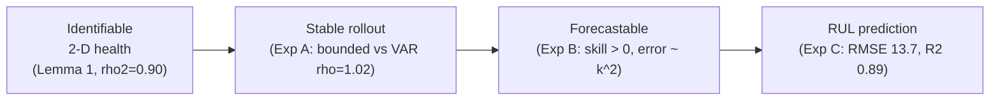

# Health-Manifold Theory & Skeptical Experiments

This folder documents — at the level of a skeptical reviewer — the claims made
about the FD001 physics-constrained **health manifold**, with formal theorems,
proofs, and three falsifiable experiments backed by plots.

The headline questions and their answers:

| Question | Document | Verdict |
|---|---|---|
| Is the rollout actually **stable**? | [ROLLOUT_STABILITY.md](ROLLOUT_STABILITY.md) | **Yes** — provably bounded (free-run), unlike the VAR ($\rho=1.02$). |
| Can the **health state** be forecast? | [HEALTH_FORECASTING.md](HEALTH_FORECASTING.md) | **Yes** — beats persistence by skill $+0.66$–$0.77$; polynomial error. |
| Does it predict **RUL**? | [RUL_PREDICTION.md](RUL_PREDICTION.md) | **Yes** — RMSE $13.7$, $R^2=0.89$ on the official test set. |
| What is the **math** behind all this? | [THEORY.md](THEORY.md) | 5 theorems + proofs, each tied to an experiment. |

---

## The logical chain



1. **Identifiable** — a single operating condition collapses the degradation to
   a 2-D manifold (PCA $\rho_2 = 0.901$); the autoencoder recovers it
   (mean test $R^2 = 0.969$).
2. **Stable** — the logistic latent + Lipschitz decoder make the rollout
   *bounded for all horizons* (Theorem 2), whereas a sensor-space VAR is
   non-contractive ($\rho(A)=1.02$) and diverges (Theorem 1). The free-run
   divergence plot is the decisive evidence.
3. **Forecastable** — because the health coordinate is smooth/monotone (small
   curvature $\kappa$), constant-velocity extrapolation has polynomial error
   $\le \tfrac{\kappa}{2}k^2$ (Theorem 3) and beats persistence.
4. **Useful** — the forecastable state (+ its velocity) predicts RUL with
   RMSE 13.7 on the official FD001 test set (Proposition 5).

---

## Reproducing the experiments

```powershell
# from the project root, using the project venv
cd experiments
..\.venv\Scripts\python.exe exp_rollout_stability.py    # Exp A  -> figures A1..A4
..\.venv\Scripts\python.exe exp_health_forecasting.py   # Exp B  -> figures B1..B3
..\.venv\Scripts\python.exe exp_rul_prediction.py       # Exp C  -> figures C1..C3
cd ..
```

All three scripts share [`../experiments/manifold_core.py`](../experiments/manifold_core.py),
which trains the $k=2$ manifold **once** and caches it to
`experiments/artifacts/` so every experiment uses an identical encoder,
decoder, standardization, and denoising convention. Figures are written to
[`figures/`](figures/); numeric artifacts to `experiments/artifacts/`.

---

## Figure index

| File | Shows |
|---|---|
| `figures/A1_rollout_r2_vs_horizon.png` | Rollout NRMSE / cross-engine $R^2$ vs horizon |
| `figures/A2_var_eigenvalues.png` | VAR eigenvalues outside the unit circle ($\rho=1.02$) |
| `figures/A3_example_trajectories.png` | True vs manifold vs VAR for one engine |
| `figures/A4_free_run_divergence.png` | **Decisive**: VAR diverges, manifold bounded |
| `figures/B1_health_forecasts.png` | Example health forecasts from 50 % life |
| `figures/B2_error_vs_horizon.png` | Forecast error under the $\tfrac{\kappa}{2}k^2$ envelope |
| `figures/B3_skill_vs_persistence.png` | Forecast skill vs persistence (h0, h1) |
| `figures/C1_rul_scatter.png` | Predicted vs true RUL + error histogram |
| `figures/C2_examples.png` | Example test engines: causal health + RUL readout |
| `figures/C3_health_vs_rul.png` | Monotone health → RUL relationship |
