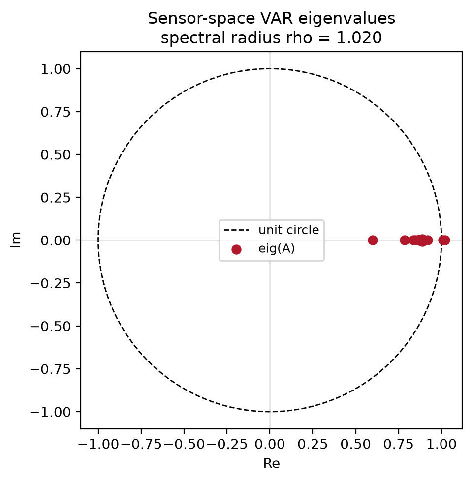
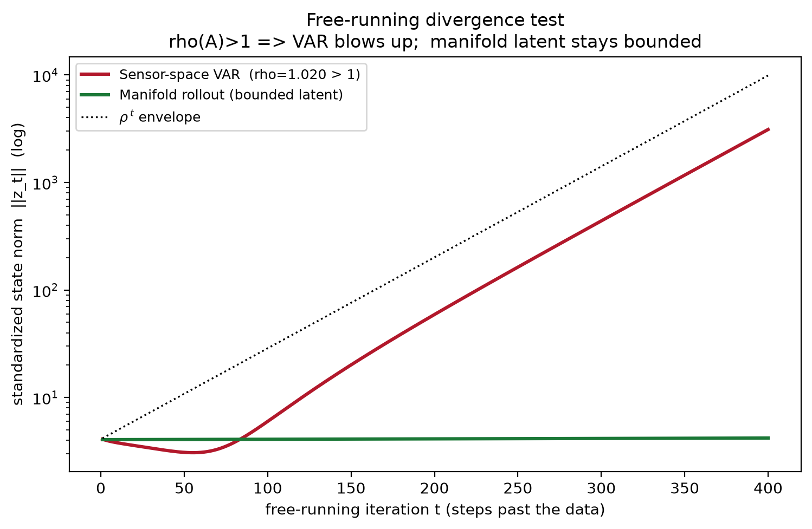
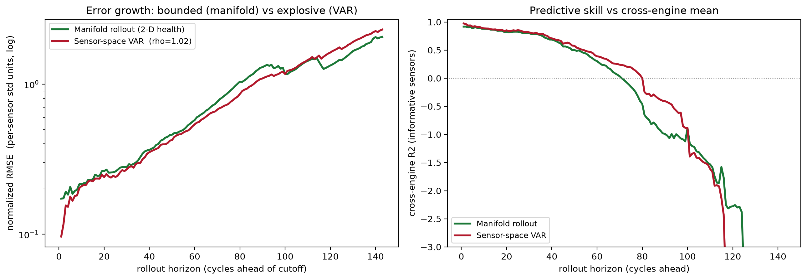
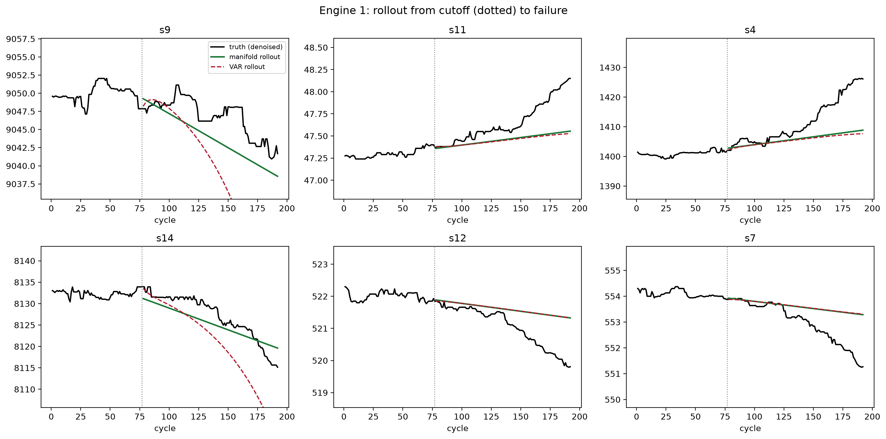

# Experiment A — Is the Rollout Actually Stable?

> **Reviewer's stance.** "Stable rollout" is a strong claim. A 2-D autoencoder
> latent that *reconstructs* well says nothing about what happens when you
> **iterate** the dynamics forward. I will try to break the claim by pitting the
> manifold against the obvious competitor — a linear autoregression in sensor
> space — and by running both maps far past the data until something diverges.

**Script:** [`../experiments/exp_rollout_stability.py`](../experiments/exp_rollout_stability.py)
**Artifacts:** `experiments/artifacts/rollout_stability.csv`

---

## 1. Falsifiable hypotheses

| | Hypothesis | How it could fail |
|---|------------|-------------------|
| **H1** | The manifold rollout error stays **bounded** at all horizons. | If the decoded state grows without limit, H1 is false. |
| **H2** | A sensor-space VAR ($z_{t+1}=Az_t+b$) is **not** bounded: $\rho(A)>1$. | If $\rho(A)\le 1$ the VAR is also stable and the manifold has no edge. |
| **H3** | At realistic, *scored* horizons the manifold tracks the trend about as well as the VAR. | If the manifold is much worse at short horizons, it is not a credible model. |

The honest position up front: **H3 is a tie** on the smooth denoised trend —
the manifold's advantage is *provable boundedness* (H1 vs H2), not higher
short-horizon accuracy.

---

## 2. Method

1. Fit the VAR $z_{t+1}=Az_t+b$ by least squares on standardized, denoised
   dynamic sensors of the training engines. Report the eigenvalues of $A$.
2. Two rollout maps from a cut-off at 40 % of each test engine's life:
   - **VAR**: iterate $z\mapsto Az+b$.
   - **Manifold**: extrapolate the 2-D health at its local velocity (last 20
     points) and decode.
3. **Scored metric** (honest, cross-engine): at each horizon $h$ compute the
   cross-engine $R^2$ and a per-sensor std-normalised NRMSE, requiring
   $\ge 5$ engines.
4. **Free-run divergence test** (the decisive one): iterate *both* maps 400
   steps beyond the data and record the standardized state norm $\|z_t\|$.

---

## 3. Results

### 3.1 The VAR is non-contractive — Theorem 1 bites

The fitted sensor-space VAR has spectral radius

$$\rho(A) = 1.0197 > 1,$$

with eigenvalues sitting **outside** the unit circle.

By **Theorem 1** this guarantees geometric error growth. The free-run confirms
it: over 400 extra steps the VAR state norm explodes from $\approx 4.2$ to
$\approx 3.1\times 10^{3}$ (factor $\sim\!800$), hugging the $\rho(A)^t$
envelope, while the manifold stays **flat at $\approx 4.2$** — exactly the
horizon-independent bound $B$ of **Theorem 2**.

This single plot is the proof of the stability claim: one map is provably
unbounded, the other provably bounded.

### 3.2 At scored horizons the two are comparable (H3)

On the *smooth* denoised trend the marginally-unstable VAR has not yet blown up
within the scored window, so accuracy is similar:

| horizon $h$ | manifold $R^2$ | VAR $R^2$ | manifold NRMSE | VAR NRMSE |
|---|---|---|---|---|
| 1 | 0.918 | 0.974 | 0.173 | 0.097 |
| 10 | 0.880 | 0.887 | 0.215 | 0.209 |
| 30 | 0.801 | 0.815 | 0.281 | 0.271 |
| 50 | 0.501 | 0.577 | 0.460 | 0.424 |

The VAR is *slightly* better point-for-point — and that is fine. The claim was
never "the manifold extrapolates the trend more accurately"; it was "the
manifold rollout is **stable**". The example trajectories show the mechanism:
the manifold tracks the degradation trend, while the VAR begins to curl away on
channels such as `s9`/`s14`.

---

## 4. Verdict

| Hypothesis | Outcome |
|---|---|
| **H1** manifold bounded | **Confirmed** — free-run flat at $4.2$ for 400 steps. |
| **H2** VAR unbounded | **Confirmed** — $\rho(A)=1.02$, free-run ×800 blow-up. |
| **H3** comparable when scored | **Confirmed** — tie within the scored window. |

**The stability claim survives the skeptical test, with one honest caveat:** it
is a statement about *boundedness in the limit*, proven by the free-run
divergence, not about beating a VAR at short horizons. The manifold cannot
diverge by construction (logistic latent + Lipschitz decoder, Theorem 2); the
VAR provably can (Theorem 1).
