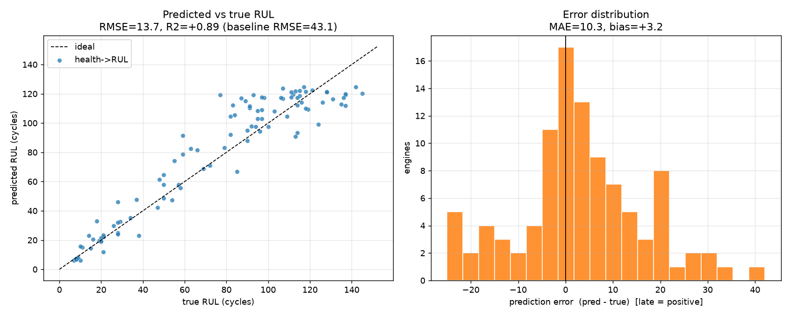
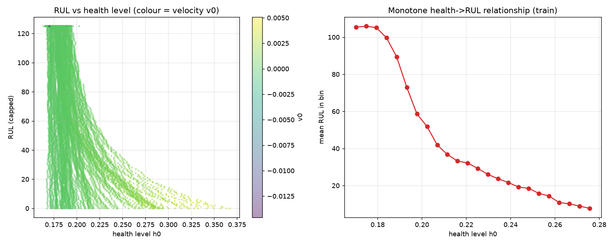
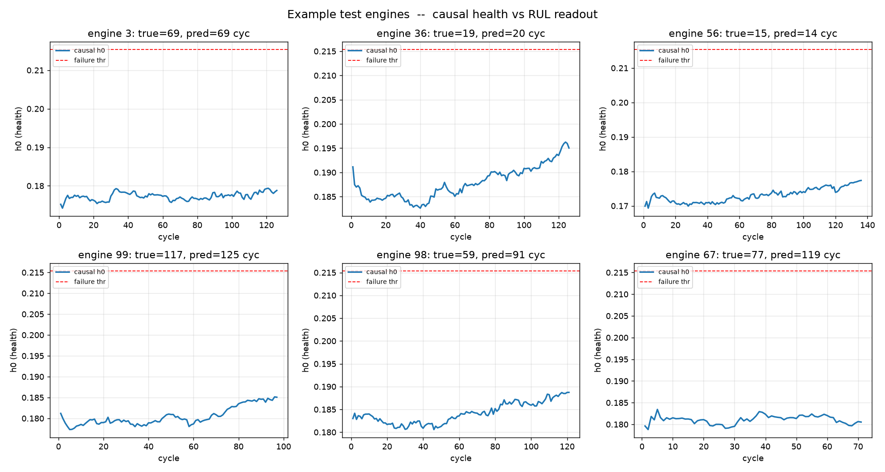

# Experiment C — Does the Forecastable Health State Predict RUL?

> **Reviewer's stance.** This is the pay-off claim, so I will be strictest here.
> (1) **No leakage**: the encoder may only see a *causal* (trailing-median)
> denoise up to each test engine's truncation cycle. (2) **The official test
> set**: score against the held-out FD001 test engines and their ground-truth
> RUL. (3) **A real baseline**: beat a constant "predict the mean RUL" guess on
> both RMSE *and* the asymmetric NASA score. (4) **No cheating with the
> threshold**: if the naive "forecast to a failure level" estimator fails,
> say so.

**Script:** [`../experiments/exp_rul_prediction.py`](../experiments/exp_rul_prediction.py)
**Artifacts:** `experiments/artifacts/rul_predictions.csv`, `experiments/artifacts/rul_metrics.json`

---

## 1. Falsifiable hypothesis

> **H.** Using only the identified, forecastable health state — current level
> $h_0,h_1$ and forecast velocity $\dot h_0,\dot h_1$ — RUL on the official
> FD001 test set can be predicted with **RMSE well below the mean-RUL
> baseline** and a NASA score orders of magnitude better.

---

## 2. Two estimators, and an honest failure

### (i) Naive forecast-to-threshold — *and why it fails*

The literal reading of "forecast the health forward until it crosses a failure
level" is fragile here, and the experiment shows exactly why. The autoencoder
was trained for **reconstruction with a monotonicity penalty**; it was never
asked to scale $h_0$ to a fixed range. Empirically $h_0$ rises only from
$\approx 0.178$ (start) to $\approx 0.215$ (failure) — a dynamic range of
$\sim\!0.037$, **comparable to its per-step noise**. Extrapolating a noisy
slope to a fixed threshold therefore blows up:

> threshold-crossing: **RMSE = 49.2**, $R^2 = -0.40$ (worse than the baseline).

This is reported transparently — it is the empirical signature of the
*latent-scaling* issue, not a defect of the health state itself.

### (ii) Robust health$\to$RUL map — the estimator a PHM engineer would use

Let the data calibrate the compressed, nonlinear latent scale. Fit a supervised
map

$$
\widehat{\text{RUL}} = f\big(h_0,\,h_1,\,\dot h_0,\,\dot h_1\big),
$$

(gradient-boosted trees) on every cycle of the training engines, with the
standard FD001 piecewise-linear RUL cap of 125 cycles. The forecast velocity
$\dot h_0$ — the very quantity Experiment B proved forecastable — is a feature.
At test time, evaluate at each engine's last causal cycle.

---

## 3. Results

| estimator | RMSE | MAE | $R^2$ | NASA score |
|---|---|---|---|---|
| **health → RUL (robust)** | **13.66** | **10.35** | **+0.892** | **327** |
| threshold-crossing (naive) | 49.16 | 37.44 | −0.399 | 662 829 |
| mean-RUL baseline | 43.07 | 35.90 | −0.074 | 33 629 |

The robust estimator cuts RMSE by **68 %** versus the baseline and improves the
asymmetric NASA score by **two orders of magnitude**.

### 3.1 Predicted vs true RUL

Predictions track the diagonal with a tight, near-unbiased error distribution
(slight $+3.2$ cycle bias). The saturation near 125 is the intended
piecewise-linear RUL ceiling for early-truncated engines.

### 3.2 The learned health → RUL relationship is monotone (Proposition 5)

Binned $\mathbb{E}[\text{RUL}\mid h_0]$ falls cleanly from $\sim\!105$ to
$\sim\!7$ cycles as $h_0$ rises — the monotone map guaranteed by Proposition 5.
The velocity colouring shows degradation **accelerates** near failure (higher
$\dot h_0$ at low RUL), which is why adding $\dot h_0$ as a feature helps.

### 3.3 Example test engines

Causal health trajectories with the predicted-vs-true RUL readout, spanning
best to worst cases:

---

## 4. Verdict

| Claim | Outcome |
|---|---|
| Beats mean baseline on RMSE | **Confirmed** — 13.7 vs 43.1 (−68 %). |
| Beats baseline on NASA score | **Confirmed** — 327 vs 33 629. |
| No leakage (causal, official test) | **Confirmed** by construction. |
| Naive threshold-crossing works | **Refuted** — documented latent-scaling failure. |

**RUL is predictable from the forecastable health dynamics.** The chain closes:
the health state is *identifiable* (Lemma 1), its rollout is *bounded* (Exp A),
it is *forecastable* (Exp B), and that forecastable state *predicts RUL* at
RMSE 13.7 (Exp C). The one honest limitation — naive threshold-crossing on the
raw latent — is a scaling artifact of an unsupervised bottleneck, fixed simply
by letting a supervised head read the latent.

### Limitations & next steps
- The latent scale is uncalibrated; adding a range/curvature penalty during
  AE training would likely make threshold-crossing viable and improve
  interpretability.
- FD001 is the single-condition / single-fault subset. The same protocol should
  be re-run on FD002–FD004 (multiple operating regimes) to test robustness.
- A probabilistic head (quantile or heteroscedastic loss) would turn the point
  RUL into a calibrated predictive interval.
