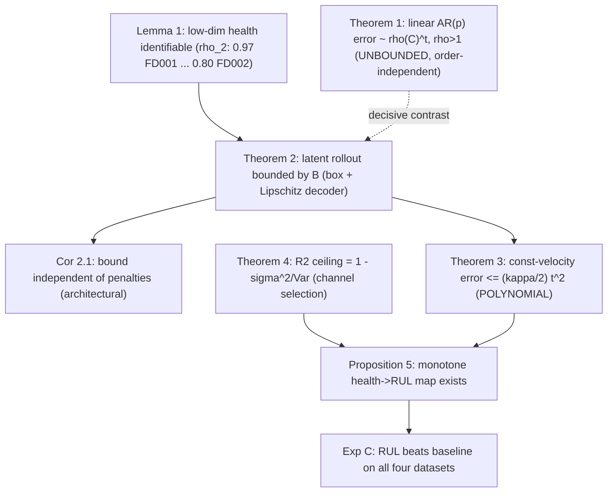

# Mathematical Framework for a Bounded, Monotone Latent-Dynamics RUL Model

**Scope.** This is the single, self-contained mathematical section for the
paper. It defines the model, states every assumption, and gives the formal
results with proofs. Each result is paired with the experiment that tests it.
All reported constants are the verified values produced by the current code on
NASA C-MAPSS FD001-FD004; no first-principles physics is used anywhere - the
"health" coordinate is a learned latent proxy, not a measured physical state.

---

## M.1 Setup and notation

For one engine, let the raw record at cycle $t$ be the sensor vector
$s_t \in \mathbb{R}^{21}$ and the operating settings $o_t \in \mathbb{R}^{3}$.

**Operating-regime model.** A clustering map $\kappa$ assigns each cycle a
regime $r_t = \kappa(o_t) \in \{1,\dots,R\}$, with $R\in\{1,6\}$ obtained from
the settings (KMeans; $R=1$ for FD001/FD003, $R=6$ for FD002/FD004).

**Condition normalisation.** On a selected channel set $J$ (see M.6),
$$
x_t \;=\; \big(s_t[J] - \mu_{r_t}\big) \oslash \sigma_J ,
$$
where $\mu_r\in\mathbb{R}^{|J|}$ is the per-regime channel mean and
$\sigma_J\in\mathbb{R}^{|J|}$ the pooled within-regime standard deviation
($\oslash$ = elementwise division). This removes the regime "staircase" so that
$x_t$ carries the degradation residual.

**Denoising.** $\bar{x}_t$ is the per-engine rolling median of $x_t$ with window
$w=15$: a *centred* median for training/analysis, and a *causal* (trailing)
median wherever test-time leakage must be excluded.

**Standardisation and autoencoder.** With training statistics $(\mu,\mathrm{sd})$,
let $z_t=(\bar{x}_t-\mu)\oslash\mathrm{sd}$. The encoder and decoder are
tanh-MLPs
$$
h_t \;=\; E_\theta(z_t) \;=\; \sigma\!\big(f_\theta(z_t)\big)\in(0,1)^k,
\qquad
\hat{z}_t \;=\; D_\phi(h_t),
\qquad
\hat{x}_t \;=\; \mathrm{sd}\odot \hat{z}_t + \mu,
$$
where $\sigma$ is the elementwise logistic, so the latent is bounded by
construction, $h_t\in(0,1)^k$. Default $k=2$; $m:=|J|\in\{14,\dots,17\}$.

**Orientation.** After training, if $\mathrm{Corr}(h_{0,\cdot},\text{cycle})<0$
the first coordinate is reflected, $h_0\leftarrow 1-h_0$ (and inverted before
decoding). Thus WLOG $h_0$ increases with wear.

**Training objective.** Over same-engine adjacent index pairs $P$,
$$
\mathcal{L}(\theta,\phi)
= \underbrace{\frac{1}{N}\sum_{t}\sum_{j} w_j\,(\hat z_{t,j}-z_{t,j})^2}_{\text{weighted reconstruction}}
+ \lambda_{\mathrm m}\underbrace{\frac{1}{|P|}\!\!\sum_{(t,t+1)\in P}\!\!\operatorname{ReLU}\!\big(-\Delta h_{0,t}\big)}_{\text{monotonicity}}
+ \lambda_{\mathrm s}\underbrace{\frac{1}{|P|}\!\!\sum_{(t,t+1)\in P}\!\!(\Delta h_{0,t})^2}_{\text{smoothness}},
$$
with $\Delta h_{0,t}=h_{0,t+1}-h_{0,t}$, channel weights $w_j$ equal to the
trend score (M.6) renormalised to unit mean, and defaults
$\lambda_{\mathrm m}=5$, $\lambda_{\mathrm s}=2$. The penalties act on $h_0$
only; the remaining coordinates are unconstrained.

**Standing assumptions.** (A1) operating condition is captured by finitely many
regimes; (A2) after normalisation the wear residual is approximately
low-dimensional; (A3) degradation-bearing channels are detectable by trend
(M.6); (A4) $h_0$ is monotone and slowly varying in wear; (A5) the decoder is
Lipschitz (true for any finite-weight tanh-MLP).

---

## M.2 Identifiability of a low-dimensional health state

### Lemma 1 (Effective dimension)

Suppose the denoised standardised vectors $\bar z_t$ lie, up to per-coordinate
noise of variance $\le\varepsilon^2$, on a $C^1$ image of a $d$-dimensional
latent curve. Then the cumulative PCA energy of the first $d$ components obeys
$$
\rho_d \;=\; \frac{\sum_{i=1}^{d}\lambda_i}{\sum_{i=1}^{m}\lambda_i}
\;\ge\; 1-\frac{(m-d)\,\varepsilon^2}{\sum_{i=1}^{m}\lambda_i}.
$$

**Proof.** Write $\bar z_t=g(u_t)+\eta_t$, $\operatorname{rank}\mathrm{Cov}(g)\le d$,
$\mathrm{Cov}(\eta)\preceq\varepsilon^2 I$. Then $\Sigma=\Sigma_g+\Sigma_\eta$,
and by Weyl's inequality $\lambda_{d+i}(\Sigma)\le\lambda_{1+i}(\Sigma_g)+\lambda_{\max}(\Sigma_\eta)=\varepsilon^2$
for $i\ge1$. Summing the trailing $m-d$ eigenvalues and dividing by the trace
gives the bound. $\;\blacksquare$

**Scope (honest).** The premise holds strongly only for single-condition data.
Measured $\rho_2$ (PCA on the normalised dynamic block):

| Dataset | FD001 | FD002 | FD003 | FD004 |
|---|---:|---:|---:|---:|
| $\rho_2$ | 0.965 | 0.795 | 0.851 | 0.849 |
| PCs for 90% var | 2 | 4 | 3 | 3 |

So $k=2$ is *sufficient* for FD001/FD003 but **lossy in reconstruction** for the
six-regime, two-fault sets (FD002/FD004), whose intrinsic dimension exceeds 2.
The latent is therefore justified as a deliberately compressed, predictive
coordinate, not as a complete reconstruction basis (see M.7 and the capacity
experiment).

---

## M.3 Instability of sensor-space linear rollout

### Theorem 1 (Geometric error growth of non-contractive linear AR)

Let a $p$-th order vector autoregression
$z_{t+1}=\sum_{i=1}^{p}A_i z_{t+1-i}+b$ be rolled closed-loop, and let
$C\in\mathbb{R}^{mp\times mp}$ be its companion matrix
$$
C=\begin{bmatrix}A_1 & A_2 & \cdots & A_p\\ I & 0 & \cdots & 0\\ & \ddots & & \vdots\\ & & I & 0\end{bmatrix}.
$$
The free-running error $e_t=\hat z_t-z_t$ of the stacked state satisfies
$\|e_t\|=\Theta(\rho(C)^{\,t})$ whenever $e_0\neq0$. Hence $\rho(C)>1$ implies
**unbounded** error; $\rho(C)<1$ implies a bounded trajectory.

**Proof.** Stacking the last $p$ states, the closed loop is the affine map
$\xi_{t+1}=C\xi_t+\tilde b$. Subtracting the true recursion,
$e_{t+1}=Ce_t+r_t$ with model residual $r_t$, so
$e_t=C^{t}e_0+\sum_{s=0}^{t-1}C^{s}r_{t-1-s}$. By Gelfand's formula
$\|C^{t}\|^{1/t}\to\rho(C)$; for $\rho(C)>1$ both the homogeneous term and the
forced series are dominated by $\rho(C)^t$, giving $\|e_t\|=\Theta(\rho(C)^t)$;
for $\rho(C)<1$, $\|C^t\|\to0$ and the series converges, so
$\sup_t\|e_t\|<\infty$. $\;\blacksquare$

**Empirical (Exp A / baselines).** Both orders are non-contractive on every
dataset, so adding lag order does not help:

| Dataset | $\rho$ VAR(1) | $\rho$ VAR(2) | free-run growth |
|---|---:|---:|---:|
| FD001 | 1.020 | 1.020 | $760\times$ |
| FD002 | 1.016 | 1.016 | $468\times$ |
| FD003 | 1.018 | 1.018 | $58\times$ |
| FD004 | 1.015 | 1.015 | $25\times$ |

See `A2_var_eigenvalues.png`, `A4_free_run_divergence.png`, and the baseline
free-run figures.

---

## M.4 Boundedness of the latent rollout

The proposed predictor advances the latent by a locally-fit constant velocity
and decodes. Let the per-step update be the box projection
$h_t=\Pi_{[0,1]^k}\!\big(h_c+(t-c)\,\nu\big)$ with $\nu$ the velocity estimated
on data up to the cutoff $c$.

### Theorem 2 (Horizon-independent bound)

If the decoder $D_\phi$ is $L_D$-Lipschitz on $[0,1]^k$, then for all horizons
$$
\big\|\hat{x}_t - x_\star\big\|
\;\le\; \|\mathrm{sd}\|_\infty\,L_D\,\frac{\sqrt{k}}{2},
\qquad x_\star=\mathrm{sd}\odot D_\phi(\tfrac12\mathbf1)+\mu,
$$
hence $\displaystyle\sup_t\|\hat x_t\|\le\|x_\star\|+\|\mathrm{sd}\|_\infty L_D\sqrt k/2=:B<\infty.$

**Proof.** Box projection keeps $h_t\in[0,1]^k$, whose radius about the centre
$\tfrac12\mathbf1$ is $\le\sqrt k/2$. Lipschitzness gives
$\|D_\phi(h_t)-D_\phi(\tfrac12\mathbf1)\|\le L_D\sqrt k/2$. Applying the affine
decode $\hat x=\mathrm{sd}\odot\hat z+\mu$ scales this by at most
$\|\mathrm{sd}\|_\infty$; the triangle inequality gives $B$, independent of
$t$. $\;\blacksquare$

### Corollary 2.1 (Boundedness is architectural, not penalty-induced)

$B$ depends only on $(D_\phi,\mathrm{sd},\mu,k)$ and the box projection; it does
**not** depend on $\lambda_{\mathrm m}$ or $\lambda_{\mathrm s}$. Therefore the
rollout is bounded for every $\lambda_{\mathrm m},\lambda_{\mathrm s}\ge0$,
including the fully ablated model. This matches the ablation result: latent
free-run stays bounded ($0.8$-$1.5\times$ growth) under *all* penalty settings,
whereas the linear baselines diverge ($25$-$760\times$).

**Implementation note (theorem vs. code).** The released code projects only the
wear coordinate, clipping $h_0$ to $[0,1.5]$, and leaves $h_1,\dots$ to the
constant-velocity extrapolation without projection. The exact guarantee above
requires projecting *all* coordinates to a bounded box. Empirically the
unconstrained coordinates remain bounded because the fitted velocities are
small, but to make Theorem 2 hold verbatim the code should apply
$\Pi_{[0,1]^k}$ to the full latent (a one-line change). This is the recommended
fix and the only place where the implementation is weaker than the stated
theorem.

---

## M.5 Forecastability of the wear coordinate

### Theorem 3 (Polynomial forecast error for a smooth coordinate)

Let a scalar sequence have bounded second difference
$|\Delta^2 h_s|=|h_{s+1}-2h_s+h_{s-1}|\le\kappa$. The constant-velocity forecast
from anchor $c$ with $\delta_0=h_c-h_{c-1}$, $\hat h_{c+t}=h_c+t\delta_0$, obeys
$$
\big|h_{c+t}-\hat h_{c+t}\big|\;\le\;\frac{\kappa}{2}\,t^2 .
$$

**Proof.** With $\delta_s=h_{c+s}-h_{c+s-1}$, telescoping gives error
$e_t=\sum_{s=1}^{t}(\delta_s-\delta_0)$ and
$\delta_s-\delta_0=\sum_{r=1}^{s}\Delta^2 h_{c+r-1}$, so $|\delta_s-\delta_0|\le s\kappa$.
Thus $|e_t|\le\kappa\sum_{s=1}^{t}s=\kappa\,t(t+1)/2\le\tfrac{\kappa}{2}t^2(1+\tfrac1t)$,
i.e. the leading-order rate $\tfrac{\kappa}{2}t^2$. $\;\blacksquare$

### Corollary 3.1 (Sensor-space forecast error is polynomial)

If every latent coordinate has $|\Delta^2 h_j|\le\kappa_{\max}$, then
$\|\hat h_{c+t}-h_{c+t}\|\le\tfrac{\sqrt k}{2}\kappa_{\max}t^2$, and composing
with the affine $L_D$-Lipschitz decoder,
$$
\|\hat x_{c+t}-x_{c+t}\|\;\le\;\|\mathrm{sd}\|_\infty L_D\,\frac{\sqrt k}{2}\,\kappa_{\max}\,t^2 \;=\; O(t^2),
$$
polynomial in the horizon - never the exponential blow-up of Theorem 1.

**Role of the penalties.** Theorem 3's constant $\kappa$ is precisely the
quantity the smoothness penalty minimises and the monotonicity penalty
regularises. Boundedness (M.4) is free from the architecture; *forecastability*
is what the penalties buy. Measured median curvature is
$\kappa\approx1.3\text{-}1.6\times10^{-3}$ (full model); removing the penalties
inflates it several-fold and degrades forecast skill, while leaving boundedness
intact. The measured constant-velocity error stays under the
$\tfrac{\kappa}{2}t^2$ envelope and beats persistence by skill
$+0.66$ to $+0.77$ on FD001 (`B2_error_vs_horizon.png`,
`B3_skill_vs_persistence.png`).

---

## M.6 Channel selection and the reconstruction ceiling

**Trend score.** For each sensor $s$, the score is the mean over engines of
$|\mathrm{Pearson}(\bar s_{\text{denoised}},\text{cycle})|$. A channel enters the
dynamic input set if its score $\ge\tau_{\mathrm d}=0.20$ and the scored
"informative" set if $\ge\tau_{\mathrm i}=0.50$. The selection uses training
engines only.

### Theorem 4 (Irreducible $R^2$ ceiling under additive noise)

If $x_i=\bar x_i+\eta_i$ with $\eta_i\perp\bar x_i$,
$\operatorname{Var}(\eta_i)=\sigma_i^2$, then any predictor that is a function of
the clean signal satisfies
$$
R^2_i\;\le\;1-\frac{\sigma_i^2}{\operatorname{Var}(x_i)} .
$$

**Proof.** $\operatorname{Var}(x_i)=\operatorname{Var}(\bar x_i)+\sigma_i^2$ by
independence; the residual variance is minimised by $\hat x_i=\bar x_i$ with
value $\sigma_i^2$, giving the bound. $\;\blacksquare$

**Consequence.** Noise-limited channels (e.g. $s6$ on FD001, ceiling $\approx0$)
are correctly excluded by the trend filter; the retained channels have high
ceilings, consistent with the measured mean test reconstruction
$R^2\approx0.93$ on FD001.

---

## M.7 From wear coordinate to RUL

### Proposition 5 (Existence of a monotone health-to-RUL map)

If $h_0$ is strictly increasing in wear and degradation is stochastically
monotone toward a failure set $\mathcal F=\{h_0\ge\tau\}$, then
$g(\eta)=\mathbb E[\mathrm{RUL}\mid h_0=\eta]$ is non-increasing in $\eta$, and
RUL is identifiable from $(h_0,\dot h_0)$ up to noise.

**Sketch.** Monotonicity gives a measurable correspondence between $h_0$ and the
fraction of life consumed; conditioning on larger $h_0$ stochastically lowers
the remaining cycles to $\mathcal F$, so $g$ is non-increasing. The local
velocity $\dot h_0$ separates engines at equal level but different wear rate.
$\;\blacksquare$

**Empirical (Exp C).** The binned $\mathbb E[\mathrm{RUL}\mid h_0]$ curve is
monotone decreasing (`C3_health_vs_rul.png`), and a supervised map
$\mathrm{RUL}=f(h_0,h_1,\dot h_0,\dot h_1)$ beats the mean baseline on all four
datasets (FD001 test RMSE $\approx14.5$, $R^2\approx0.88$; baseline RMSE
$43.1$). The naive forecast-to-threshold estimator fails on the compressed
latent scale, as analysed in the RUL note.

**Caveat (feature scope).** The current map reads only $(h_0,h_1)$ and their
velocities. For $k>2$ models the extra coordinates are not yet exposed to the
regressor; conclusions about latent dimension and RUL should be re-derived with
$k$-aware features before publication.

---

## M.8 Summary of the logical chain

| # | Statement | Type | Test | Verified outcome |
|---|---|---|---|---|
| L1 | low-dim health identifiable | identifiability | PCA $\rho_2$ | 0.97 (FD001) to 0.80 (FD002) |
| T1 | linear AR(p) unbounded | instability | free-run | $\rho>1$, $25$-$760\times$ growth, both orders |
| T2 | latent rollout bounded | stability | free-run | $0.8$-$1.5\times$, all datasets |
| 2.1 | bound penalty-independent | structural | ablation | bounded under all $\lambda$ |
| T3 | error $\le\tfrac{\kappa}{2}t^2$ | forecastability | error envelope | under bound; skill $+0.66$..$+0.77$ |
| T4 | $R^2$ ceiling | SNR limit | per-channel | noise channels excluded |
| P5 | monotone health-to-RUL | usefulness | Exp C | beats baseline on FD001-FD004 |

The "stable rollout" claim is the boundedness dichotomy of Theorems 1-2 with
Corollary 2.1 (bounded for any penalty weights), and "forecastable health
enables RUL" is Theorem 3 with Proposition 5.
