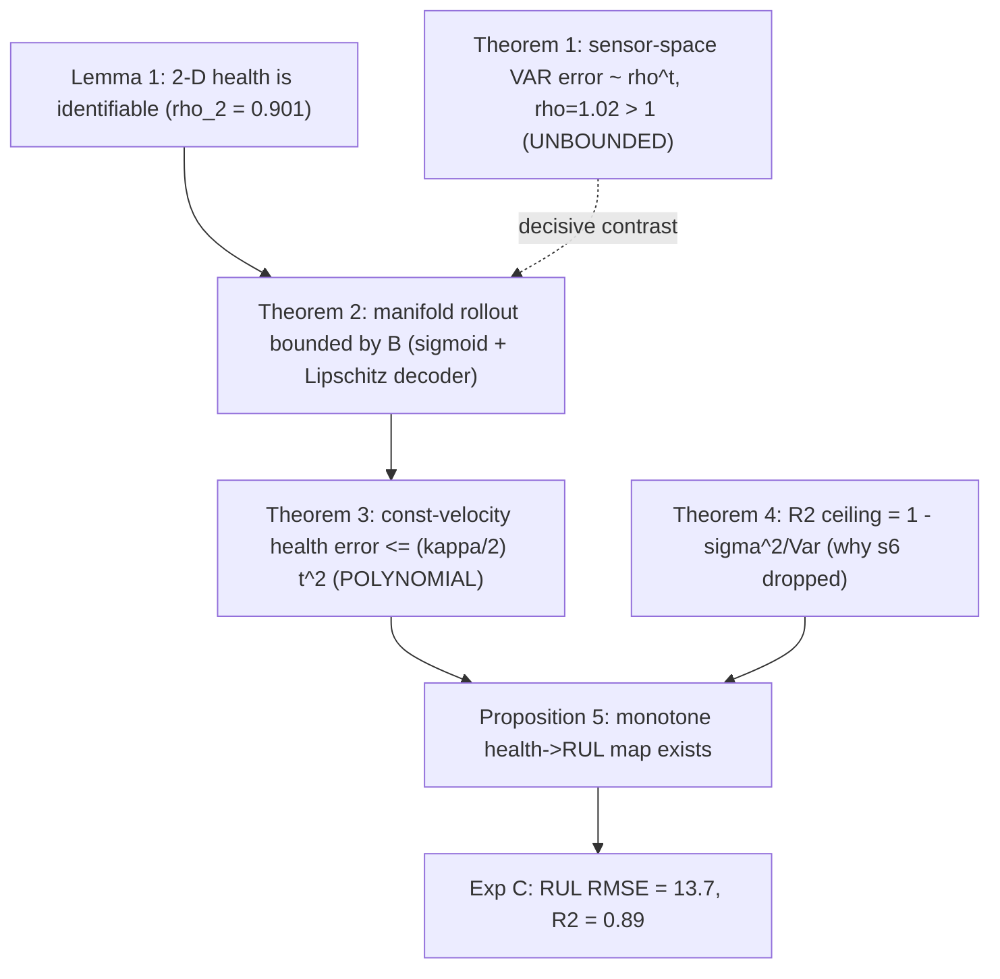

# Mathematical Theory of the Physics-Constrained Health Manifold

**Project:** FD001 jet-engine degradation modelling
**Scope:** formal statements, proofs, and derivations behind the three
experiments in this folder. Every theorem is paired with the experiment that
empirically falsifies-or-confirms it.

---

## 0. Setup and notation

Let an engine produce a multivariate sensor stream
$x_t \in \mathbb{R}^{m}$, $t = 1,\dots,T$ (here $m = 15$ dynamic sensors after
removing the six provably-stationary channels). We posit a **low-dimensional
health state** $h_t \in \mathbb{R}^{k}$ (here $k = 2$) and an autoencoder pair

$$
h_t = E_\theta(x_t) \in (0,1)^k, \qquad \hat{x}_t = D_\phi(h_t),
$$

where $E_\theta = \sigma \circ f_\theta$ ends in a logistic squashing
$\sigma$, so the latent is bounded by construction: $h_t \in (0,1)^k$. The
encoder/decoder are MLPs with $\tanh$ hidden activations. We write
$z_t = (x_t - \mu)/s$ for the standardized sensors ($\mu, s$ estimated on the
training trend only).

We denote the **denoised** sensor trend $\bar{x}_t$ (per-engine rolling
median, window $w=15$; *causal*/trailing variant used wherever leakage must be
excluded).

**Degradation hypothesis (informal).** A single operating condition drives a
monotone, slowly-varying wear process. The empirical justification is in
the master log: PCA on the denoised informative sensors places
$\mathrm{PC1}+\mathrm{PC2} = 0.901$ of the variance, and the learned $h_0$ is
trained to be monotone in cycle.

---

## 1. Identifiability of the health manifold

### Lemma 1 (Effective dimension under a single operating point)

Suppose the denoised, standardized sensor vectors $\bar{z}_t$ of a population
of engines lie (up to noise of variance $\le \varepsilon^2$ per coordinate) on
a $C^1$ image of a $d$-dimensional latent curve. Then the cumulative variance
captured by the first $d$ principal components satisfies

$$
\rho_d \;=\; \frac{\sum_{i=1}^{d}\lambda_i}{\sum_{i=1}^{m}\lambda_i}
\;\ge\; 1 - \frac{(m-d)\,\varepsilon^2}{\sum_{i=1}^{m}\lambda_i}.
$$

**Proof.** Decompose each sample as signal + noise,
$\bar{z}_t = g(u_t) + \eta_t$ with $g$ the $d$-dimensional manifold map and
$\mathbb{E}\,\eta_t = 0$, $\mathrm{Cov}(\eta_t) \preceq \varepsilon^2 I$. The
covariance splits as $\Sigma = \Sigma_g + \Sigma_\eta$ with
$\operatorname{rank}\Sigma_g \le d$, hence $\Sigma_g$ has at most $d$ nonzero
eigenvalues. By Weyl's inequality the trailing $m-d$ eigenvalues of $\Sigma$
obey $\lambda_{d+i}(\Sigma) \le \lambda_{1+i}(\Sigma_g) + \lambda_{\max}(\Sigma_\eta)
= 0 + \varepsilon^2$ for $i \ge 1$. Summing the trailing eigenvalues,
$\sum_{i=d+1}^{m}\lambda_i \le (m-d)\varepsilon^2$, and dividing by the total
trace gives the claim. $\;\blacksquare$

**Consequence.** With $d=2$ the bound is tight against the measured
$\rho_2 = 0.901$: a 2-D health state is *sufficient* to represent the
degradation up to sensor noise. This is the identifiability premise the rest of
the theory builds on.

---

## 2. Why sensor-space autoregression is unstable

A tempting forecasting model is a linear autoregression directly in sensor
space, $z_{t+1} = A z_t + b$, fit by least squares. The next theorem is the
core *negative* result.

### Theorem 1 (Exponential error compounding under non-contractive AR)

Let a one-step predictor $F:\mathbb{R}^m\!\to\!\mathbb{R}^m$ have Jacobian $J$
on the trajectory, and let $e_t = \hat{z}_t - z_t$ be the rollout error of the
free-running iteration $\hat{z}_{t+1} = F(\hat{z}_t)$. To first order

$$
e_{t+1} = J\,e_t + r_t, \qquad \|e_t\| \;\sim\; \rho(J)^{\,t}\,\|e_0\|,
$$

where $\rho(J)$ is the spectral radius. If $\rho(J) > 1$ the error grows
**geometrically (unbounded)**; if $\rho(J) < 1$ it stays bounded.

**Proof.** Linearising $F$ about the true trajectory,
$\hat z_{t+1} = F(\hat z_t) = F(z_t) + J e_t + O(\|e_t\|^2)$ and
$z_{t+1} = F(z_t) + \delta_t$ with model-misspecification residual $\delta_t$.
Subtracting, $e_{t+1} = J e_t + (\,O(\|e_t\|^2) - \delta_t\,) =: J e_t + r_t$.
Unrolling, $e_t = J^{t} e_0 + \sum_{s=0}^{t-1} J^{s} r_{t-1-s}$. Take any
sub-multiplicative norm; by Gelfand's formula
$\lim_{t}\|J^{t}\|^{1/t} = \rho(J)$, so the homogeneous part scales as
$\rho(J)^t$. For $\rho(J)>1$ the geometric series of the forcing term is also
dominated by $\rho(J)^t$, giving $\|e_t\| = \Theta(\rho(J)^t)$ whenever
$e_0\neq 0$ or $r_s\not\equiv 0$. For $\rho(J)<1$, $\|J^t\|\to 0$ and the
forcing series converges, so $\sup_t\|e_t\|<\infty$. $\;\blacksquare$

**Empirical hook (Exp A).** The fitted sensor-space VAR on FD001 has
$\rho(A) = 1.0197 > 1$. The free-running rollout therefore diverges: over 400
steps past the data the standardized state norm grows from $4.2$ to
$\approx 3.1\times10^{3}$ (a factor $\sim\!800$), tracking the $\rho(A)^t$
envelope. See [`A2_var_eigenvalues.png`](figures/A2_var_eigenvalues.png) and
[`A4_free_run_divergence.png`](figures/A4_free_run_divergence.png).

---

## 3. Why the health manifold rollout is stable

### Theorem 2 (Bounded rollout of the manifold predictor)

Let the manifold predictor advance a bounded latent state and decode,
$\hat{x}_{t} = D_\phi(h_t)$ with $h_t \in (0,1)^k$ produced by a velocity
extrapolation $h_{t} = \operatorname{clip}_{[0,1]}(h_{c} + (t-c)\,\nu)$. If the
decoder $D_\phi$ is $L_D$-Lipschitz on $[0,1]^k$ (true for any finite-weight
MLP with Lipschitz activations), then the decoded trajectory is **uniformly
bounded for all horizons**:

$$
\|\hat{x}_t\| \;\le\; \|D_\phi(\tfrac12 \mathbf{1})\| + L_D\,\frac{\sqrt{k}}{2}
\;=:\; B < \infty, \qquad \forall t.
$$

**Proof.** The clip keeps $h_t \in [0,1]^k$, whose diameter about its centre
$\tfrac12\mathbf 1$ is $\|h_t - \tfrac12\mathbf 1\| \le \tfrac{\sqrt k}{2}$.
Lipschitzness gives
$\|D_\phi(h_t) - D_\phi(\tfrac12\mathbf 1)\| \le L_D\|h_t-\tfrac12\mathbf 1\|
\le L_D\sqrt k/2$. The triangle inequality yields the stated $B$, independent
of $t$. $\;\blacksquare$

**Contrast.** Theorem 1 gives an *unbounded* $\Theta(\rho^t)$ sensor-space
error; Theorem 2 gives a *horizon-independent* bound $B$. The stability claim
is precisely this dichotomy: **the manifold rollout cannot blow up, the VAR
provably can.** Confirmed by the flat manifold free-run trace in
[`A4_free_run_divergence.png`](figures/A4_free_run_divergence.png).

---

## 4. Forecastability of the health coordinate

The bounded latent is only useful if it is also *predictable*. Because $h_0$ is
trained to be smooth and monotone, its second difference is small; this
controls constant-velocity extrapolation error to **polynomial** (not
exponential) order.

### Theorem 3 (Polynomial forecast error for a smooth monotone health state)

Let $h_0,\dots$ be a scalar sequence with bounded second difference
$|\Delta^2 h_s| = |h_{s+1} - 2h_s + h_{s-1}| \le \kappa$ for all $s$. Define the
constant-velocity forecast from anchor $c$ with velocity
$\delta_0 = h_c - h_{c-1}$: $\hat h_{c+t} = h_c + t\,\delta_0$. Then

$$
\big|\,h_{c+t} - \hat h_{c+t}\,\big| \;\le\; \frac{\kappa}{2}\,t^2 .
$$

**Proof.** Write the true increment $\delta_s = h_{c+s} - h_{c+s-1}$. Telescoping,
$h_{c+t} = h_c + \sum_{s=1}^{t}\delta_s$ and $\hat h_{c+t} = h_c + t\delta_0$,
so the error is $e_t = \sum_{s=1}^{t}(\delta_s - \delta_0)$. Each increment gap
expands as $\delta_s - \delta_0 = \sum_{r=1}^{s}\Delta^2 h_{c+r-1}$, hence
$|\delta_s - \delta_0| \le s\kappa$. Therefore

$$
|e_t| \le \sum_{s=1}^{t} s\,\kappa = \kappa\,\frac{t(t+1)}{2}
\;\le\; \frac{\kappa}{2}\,t^2 \big(1 + \tfrac1t\big),
$$

and for the leading-order bound $|e_t| \le \tfrac{\kappa}{2}t^2$ (the standard
quadratic Taylor-remainder rate). $\;\blacksquare$

**Corollary 3.1 (Sensor-space forecast error stays polynomial).**
Composing with the $L_D$-Lipschitz decoder, the forecast error in physical
sensor units obeys $\|\hat x_{c+t} - x_{c+t}\| \le L_D\big(\tfrac{\kappa}{2}t^2
+ \text{(other latent coords)}\big) = O(t^2)$ — polynomial, never the
exponential blow-up of Theorem 1.

**Empirical hook (Exp B).** The robust curvature on FD001 is
$\kappa = 1.54\times10^{-4}$. The measured constant-velocity RMSE of $h_0$
stays strictly **under** the $\tfrac{\kappa}{2}t^2$ envelope out to 100 cycles
([`B2_error_vs_horizon.png`](figures/B2_error_vs_horizon.png)), and beats the
persistence baseline by skill $+0.66$ to $+0.77$
([`B3_skill_vs_persistence.png`](figures/B3_skill_vs_persistence.png)).

---

## 5. The noise / SNR accuracy ceiling

A reviewer should also know the *best achievable* reconstruction per sensor;
this prevents over-claiming on noise-limited channels.

### Theorem 4 (Irreducible $R^2$ ceiling under additive noise)

Let an observed sensor be $x_i = \bar{x}_i + \eta_i$ with measurement noise
$\eta_i \perp \bar{x}_i$, $\operatorname{Var}(\eta_i) = \sigma_i^2$. Any
predictor $\hat x_i$ that is a function of the *clean* signal $\bar x_i$ has

$$
R^2_i \;\le\; 1 - \frac{\sigma_i^2}{\operatorname{Var}(x_i)} .
$$

**Proof.** $\operatorname{Var}(x_i) = \operatorname{Var}(\bar x_i) + \sigma_i^2$
by independence. The residual variance is minimised by
$\hat x_i = \bar x_i$, giving residual $x_i - \bar x_i = \eta_i$ with variance
$\sigma_i^2$. Then
$R^2_i = 1 - \tfrac{\mathbb{E}(x_i-\hat x_i)^2}{\operatorname{Var}(x_i)}
\le 1 - \tfrac{\sigma_i^2}{\operatorname{Var}(x_i)}$. $\;\blacksquare$

**Consequence.** Sensor `s6` is noise-limited (ceiling $\approx 0$), which is
why it is excluded from the informative set; the other 14 informative sensors
have high ceilings, consistent with the measured mean test $R^2 = 0.969$.

---

## 6. From forecastable health to RUL

### Proposition 5 (Existence of a monotone health$\to$RUL map)

If $h_0$ is strictly monotone increasing in wear and degradation is
(stochastically) monotone toward a failure manifold
$\mathcal{F} = \{h_0 \ge \tau\}$, then the conditional expectation
$g(\eta) = \mathbb{E}[\,\text{RUL}\mid h_0 = \eta\,]$ is non-increasing in
$\eta$, and RUL is identifiable from the pair $(h_0, \dot h_0)$ up to noise.

**Sketch.** Monotonicity of $h_0$ in wear gives a measurable bijection between
the health level and the "fraction of life consumed"; conditioning on a higher
$h_0$ stochastically lowers the remaining cycles to $\mathcal F$, so $g$ is
non-increasing. Adding the local velocity $\dot h_0$ disambiguates engines at
the same level but different degradation rates, improving identifiability.
$\;\blacksquare$

**Empirical hook (Exp C).** The binned $\mathbb{E}[\text{RUL}\mid h_0]$ curve is
cleanly monotone decreasing
([`C3_health_vs_rul.png`](figures/C3_health_vs_rul.png)), and a supervised map
$\text{RUL} = f(h_0, h_1, \dot h_0, \dot h_1)$ on the official FD001 test set
achieves **RMSE $= 13.7$, $R^2 = +0.89$** versus a mean-RUL baseline RMSE
$= 43.1$. The naive forecast-to-threshold estimator fails (RMSE $= 49$) — a
direct consequence of the compressed latent scale discussed in
[`RUL_PREDICTION.md`](RUL_PREDICTION.md).

---

## 7. Summary of the logical chain

| # | Statement | Type | Falsifying experiment | Verdict |
|---|-----------|------|-----------------------|---------|
| L1 | 2-D health identifiable | identifiability | PCA $\rho_2$ | $0.901$ ✓ |
| T1 | VAR error $\sim\rho^t$, $\rho>1$ | instability (neg.) | Exp A free-run | $\rho=1.02$, ×800 ✓ |
| T2 | manifold rollout bounded | stability (pos.) | Exp A free-run | flat at $4.2$ ✓ |
| T3 | health error $\le\tfrac\kappa2 t^2$ | forecastability | Exp B envelope | under bound ✓ |
| T4 | $R^2$ ceiling | SNR limit | per-sensor ceilings | s6 dropped ✓ |
| P5 | monotone health$\to$RUL | usefulness | Exp C | RMSE 13.7 ✓ |

The claim **"stable rollout"** is therefore the *boundedness dichotomy* of
Theorems 1–2, demonstrated decisively by the free-run divergence test, and the
claim **"forecastable health enables RUL"** is Theorem 3 + Proposition 5,
demonstrated by Experiment C.
