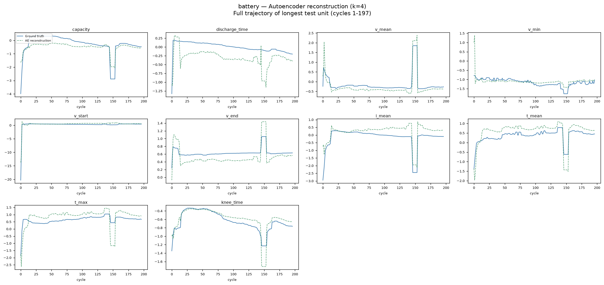
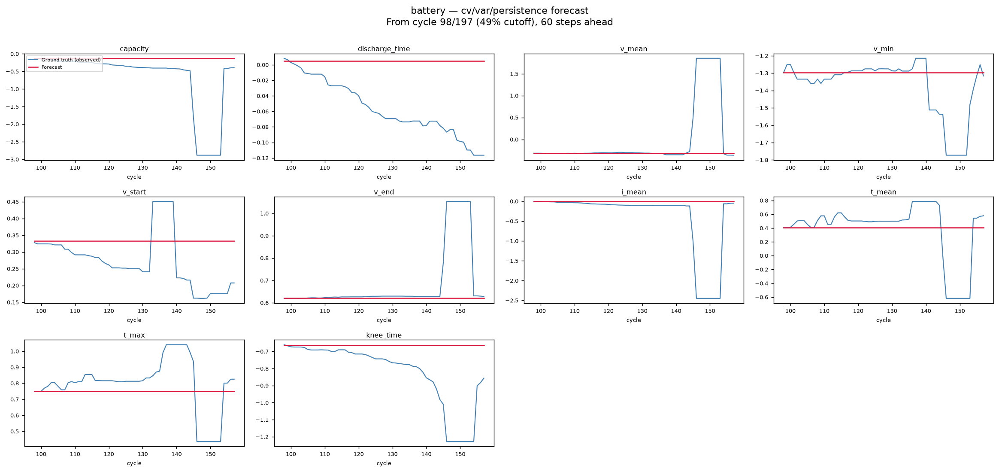

    # battery — Experiment Report

    > **Dataset:** NASA Li-ion battery — 26 batteries, 10 per-discharge-cycle features (capacity fade + V/I/T summaries).

    ---

    ## 1. What this experiment does

    We apply a **Context-Conditioned Bounded Latent Dynamics** model to this
    dataset. The core idea:

    1. An **autoencoder** squeezes the 10-variable sensor stream into
       a small **k=4** latent state.  Each latent number is forced to stay
       between 0 and 1 (bounded), so predictions can never blow up.
    2. A small **residual MLP** then learns how the latent state steps forward in
       time.  If context columns are available (calendar time, operating settings)
       it conditions on those too.
    3. Every prediction is projected back onto the [0,1] box, then decoded back
       into the original sensor space so we can compare predicted vs actual sensor
       values directly.

    Five forecasting methods are compared:

    | Label | What it does |
    |---|---|
    | **persistence** | Just repeats the last observed value forever. The laziest possible forecast. Beats it = good. |
    | **cv** | Constant-velocity rollout: extrapolates the recent trend in the latent space. The old method. |
    | **var_sensor** | Fits a linear autoregression directly on the sensors (no latent compression). |
    | **mlp_noctx** | Bounded residual MLP in latent space, no context/season/regime information. |
    | **mlp_ctx** | Bounded residual MLP in latent space, **conditioned on context features** (proposed). |

    ---

    ## 2. Methodology and parameters

    | Parameter | Value |
    |---|---|
    | Latent dimension k | **4** (chosen by k-sweep, see Section 3) |
    | AE epochs | 2000 |
    | Dynamics epochs | 400 |
    | Seeds for MLP heads | [0, 1, 2] |
    | Monotonicity penalty λ_mono | 1.0 |
    | Smoothness penalty λ_smooth | 0.5 |
    | Forecast horizons evaluated | [1, 10, 30, 60] (in cycles/steps) |
    | Train / test split | 17 / 9 units |
    | Context columns used | ['ctx_G1', 'ctx_G3', 'ctx_G4', 'ctx_G5', 'ctx_G6', 'ctx_G7', 'ctx_G9'] |
    | Sensors (raw → selected) | 10 → 10 |
    | Denoising window | 15 cycles (causal rolling median) |
    | Sensor selection threshold | trend |corr(sensor,cycle)| ≥ 0.2 |

    **Preprocessing pipeline (applied before any model training):**
    1. **Train/test split** — units split first so no preprocessing leaks across the boundary.
    2. **Denoising** — causal rolling-median (window=15 cycles) applied per unit per sensor.
       Removes cycle-to-cycle noise without looking ahead; matches the validated `manifold` pipeline.
    3. **Sensor selection** — sensors with mean |corr(sensor, cycle)| < 0.2 across training units are dropped. These sensors carry no degradation signal and only add noise to the latent space. Selected: 10/10 sensors.

    **Why k=4?**
    The k-sweep trains the autoencoder at each dimension and applies the **PCA elbow method**
    to find the latent dimension that captures the data's intrinsic structure without overfitting.
    The elbow is found using two criteria:
      1. The smallest k where cumulative explained variance ≥ 85%
      2. The k where incremental variance gain drops below 5%

    We take the **more conservative choice** (smaller k). For k=4, the reconstruction
    R² (mean across sensors) = **0.725** (worst single sensor = 0.228).

    **Why PCA elbow, not max reconstruction R²?**
    Reconstruction R² always rises with k, so choosing max R² would lead to overfitting
    (using many more latent dimensions than necessary). The PCA elbow method finds the
    "natural" dimensionality of the problem, a much more principled approach.

    **Why λ_mono=1.0?**
    The dataset has a degradation trend, so we encourage the primary latent coordinate to increase monotonically with time.  This is the *health progressing toward failure* assumption.

    ---

    ## 3. K-sweep results

    This table shows how reconstruction quality changes as we give the latent
    space more dimensions.  **recon_r2** is the mean R² across all sensors;
    **recon_r2_min** is the worst single sensor.

    |   k |   recon_r2 |   recon_r2_min |
|----:|-----------:|---------------:|
|   1 |    -0.1279 |        -1.5963 |
|   2 |     0.4035 |        -1.0822 |
|   3 |     0.5813 |        -0.2705 |
|   4 |     0.7249 |         0.2284 |
|   5 |     0.7298 |         0.1968 |
|   6 |     0.7613 |         0.3053 |

    A higher recon_r2 means the compressed representation is more faithful.
    Diminishing returns usually set in around k=3–5; we pick the elbow point
    (best recon without overfitting capacity).

    ---

    ## 4. Forecasting comparison

    **Skill vs persistence** measures "how much better than just repeating the
    last value are we?"  A skill of +0.5 means our error is half of the
    persistence error.  A skill of 0 means we tied persistence.  Negative means
    we were *worse* than doing nothing.

    **NRMSE** is the root-mean-squared forecast error expressed in standard
    deviation units of the training data, so a value of 0.5 means the average
    error is about half a standard deviation.

    **freerun_growth** is how many times larger the forecast output got over a
    long free run starting from the test cutoff.  A value near 1 is good (stable
    forecast).  Large values mean the forecast exploded.

    **bounded** = True means the growth stayed below the threshold of
    5.0×, which we define as "bounded" for reporting.

    | model       |   skill_h1 |   nrmse_h1 |   skill_h10 |   nrmse_h10 |   skill_h30 |   nrmse_h30 |   skill_h60 |   nrmse_h60 |   freerun_growth | bounded   |
|:------------|-----------:|-----------:|------------:|------------:|------------:|------------:|------------:|------------:|-----------------:|:----------|
| persistence |     0      |     0.0122 |      0      |      0.0737 |      0      |      0.1059 |      0      |      0.1742 |           1      | True      |
| cv          |  -610.778  |     0.3027 |    -15.8394 |      0.3024 |     -9.0561 |      0.3358 |     -4.2335 |      0.3985 |           1.2711 | True      |
| cv_damped   |  -610.778  |     0.3027 |    -15.1882 |      0.2965 |     -7.8908 |      0.3158 |     -2.8045 |      0.3398 |           1      | True      |
| holt        |  -602.634  |     0.3007 |    -15.0608 |      0.2953 |     -7.9039 |      0.316  |     -2.8515 |      0.3419 |           1.002  | True      |
| trend_lw    |  -610.419  |     0.3026 |    -15.2084 |      0.2966 |     -7.8604 |      0.3152 |     -2.7727 |      0.3384 |           1.0023 | True      |
| cvd_anch    |     0.0476 |     0.0119 |      0.0059 |      0.0735 |      0.0447 |      0.1035 |      0.0359 |      0.1711 |           1      | True      |
| holt_anch   |    -0.8748 |     0.0168 |     -0.0874 |      0.0768 |     -0.0751 |      0.1098 |     -0.0506 |      0.1786 |           1.0018 | True      |
| var_sensor  |   -29.8433 |     0.068  |     -7.4395 |      0.2141 |     -6.721  |      0.2943 |     -3.6469 |      0.3755 |           0.9226 | True      |
| mlp_noctx   |  -550.969  |     0.2875 |     -7.2723 |      0.211  |     -7.1702 |      0.3022 |     -5.6951 |      0.4505 |           0.5846 | True      |
| mlp_ctx     |  -610.746  |     0.3026 |    -19.4041 |      0.3307 |    -17.7603 |      0.4564 |    -12.855  |      0.6471 |           0.6343 | True      |

    **Winner:** `cvd_anch` (highest mean skill at horizons [10, 30, 60]).

    ---

    ## 5. Observation-space accuracy (best head: `cvd_anch`)

    This table shows the per-sensor forecast accuracy in the **original feature
    scale** (regime-normalized z-scores or raw feature units depending on the
    dataset).  Averaged over the three anchor points (50%, 65%, 80% of each
    test trajectory) and all test units.

    **rmse**: root-mean-squared error in original feature units.
    **r2**: coefficient of determination; 1.0 = perfect, 0 = no better than the
    mean, negative = worse than the mean.

    Values are averaged over all forecast horizons ([1, 10, 30, 60]).

    | sensor         |   rmse |      r2 |
|:---------------|-------:|--------:|
| capacity       | 0.156  | -3.5827 |
| discharge_time | 0.0767 | -3.8435 |
| i_mean         | 0.0612 |  0.31   |
| knee_time      | 0.0904 |  0.552  |
| t_max          | 0.0852 |  0.9497 |
| t_mean         | 0.1242 |  0.4331 |
| v_end          | 0.0507 | -2.2811 |
| v_mean         | 0.0584 |  0.7371 |
| v_min          | 0.0679 |  0.99   |
| v_start        | 0.0673 |  0.9301 |

    ---

    ## 6. Figures: Reconstruction and Forecast

    ### Figure (a): Reconstruction — `recon_plot.png`

    

    This figure shows how faithfully the bounded autoencoder can **rebuild** the
    sensor values from the k=4 latent numbers, using the full observed
    trajectory of the longest test unit.

    | Element | What it means |
    |---|---|
    | **Blue solid line** | Ground truth — actual recorded sensor values |
    | **Green dashed line** | AE reconstruction — what the bounded AE rebuilds from the 4 latent numbers |

    If the green line follows the blue line closely, the k=4 latent space
    captures the data well. Large gaps mean information was lost in compression.
    This is a "no-forecast" check: can the model even represent the data?

    ---

    ### Figure (b): Forecast — `forecast_plot.png`

    

    This figure shows the **predictions** made by the best-head model (`cvd_anch`)
    starting from a mid-to-late point through the trajectory of the longest test unit.

    | Element | What it means |
    |---|---|
    | **Blue solid line** | Ground truth — the actual sensor values after the cutoff (what really happened) |
    | **Red solid line** | Forecast — the model's predicted future values |

    **Cutoff strategy:** The forecast starts at the later of (1) 50% through the trajectory
    or (2) 2× the maximum forecast horizon before the end. This ensures you see a
    substantial forecast window (at least 2× max_horizon steps) to evaluate where
    predictions diverge from reality. If the red line stays close to the blue line,
    the model can predict well. If they diverge sharply, explode, or flatten, the
    forecast is unreliable.

    ---

    ## 7. Observation-space accuracy (best head: `cvd_anch`)

    This table shows the per-sensor forecast accuracy in the **original feature
    scale** (regime-normalized z-scores or raw feature units depending on the
    dataset).  Averaged over the three anchor points (50%, 65%, 80% of each
    test trajectory) and all test units.

    **rmse**: root-mean-squared error in original feature units.
    **r2**: coefficient of determination; 1.0 = perfect, 0 = no better than the
    mean, negative = worse than the mean.

    Values are averaged over all forecast horizons ([1, 10, 30, 60]).

    | sensor         |   rmse |      r2 |
|:---------------|-------:|--------:|
| capacity       | 0.156  | -3.5827 |
| discharge_time | 0.0767 | -3.8435 |
| i_mean         | 0.0612 |  0.31   |
| knee_time      | 0.0904 |  0.552  |
| t_max          | 0.0852 |  0.9497 |
| t_mean         | 0.1242 |  0.4331 |
| v_end          | 0.0507 | -2.2811 |
| v_mean         | 0.0584 |  0.7371 |
| v_min          | 0.0679 |  0.99   |
| v_start        | 0.0673 |  0.9301 |

    ---

    ## 8. Honest summary

    ### What worked
    - Reconstruction R² at the chosen k = **0.725**.
- Best head (`cvd_anch`) achieves positive forecast skill at h=10: **+0.006** (beats persistence).
- The best-head free-run forecast stays bounded (growth = 1.00×).

    ### What did not work / limitations
    - **Constant-velocity rollout** (old method) performs poorly at h=10 (skill -15.839), confirming it is the weakest link.

    ---

    *Generated automatically by experiments/acml/exp_all_datasets.py*
